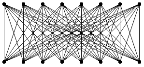
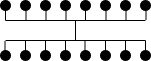

# [Basic Primitives](https://www.basicprimitives.com) Diagrams for JavaScript

Data visualization diagramming components library for dependencies visualization and analysis that implements organizational chart, family chart, inheritance, dependency trees, and business ownership diagrams provides a reach feature set for automatic layout customization and visual node annotation.

### Project references
* [http://www.basicprimitives.com](https://www.basicprimitives.com) project home and React Live Demos.
* [GitHub](https://github.com/BasicPrimitives) Github repositories.
* [NPM](https://www.npmjs.com/package/basicprimitives) official - release packages.
* [Basic Primitives for React Live Demos](https://basicprimitives.github.io/react/) - github live site
* [Basic Primitives for JavaScript, Bootstrap and PDFkit Live Demos & Samples](https://basicprimitives.github.io/javascript/) - github live site

## Products
### Basic Primitives Diagrams for JavaScript
* 100% client side JavaScript layout and rendering.
* No dependencies on 3rd party libraries.
* [SVG](https://en.wikipedia.org/wiki/Scalable_Vector_Graphics) and [Canvas](https://en.wikipedia.org/wiki/Canvas_element) support.
* Webpack [Tree Shaking](https://webpack.js.org/guides/tree-shaking/) support

### Basic Primitives Diagrams for [React](https://reactjs.org/)
* [create-react-app](https://github.com/facebook/create-react-app#readme) compatible 
* User [JSX](https://reactjs.org/docs/introducing-jsx.html) templates
* 100% [Virtual DOM](https://reactjs.org/docs/faq-internals.html) rendering cycle
* [react-dnd](http://react-dnd.github.io/react-dnd/about) & [React Context](https://reactjs.org/docs/context.html) compatible 

### Basic Primitives Diagrams for [PDFkit](http://pdfkit.org/)
* Browser based or NodeJS based PDF rendering

## Open Source
One of our product's key features is that you can download the source code under any of the licenses, free or not, and make your edits to it. Source code will enable you to make modifications and guarantees long term security for your product. Additionally, the library's source code can be validated and easily tested through our samples, demos, and unit tests.
The samples, demos, and unit tests can be found online and provided within the product packages.

## Product for visual data analysis of diagrams
Business intelligence systems and applications are designed for two major areas: reporting and analytics. Reporting applications display the original data sets and individual values without modifications, omitted values, roundings, and excessive abbreviations. On the other side, some applications are designed for data analytics and are focused on the most valuable and user-relevant data. Going as far as removing data deemed irrelevant to the end-user depends on what they are interested in analyzing. Our components provide various API options to the developers to configure our diagrams and use them for both reporting and analytics scenarios.

#### Auto layout and fitting the diagram into a single screen space
When using a graphics editor to draw your diagrams manually, it is common to have large gaps between the nodes. Large gaps between nodes make the chart unreadable, hard to edit, and navigate. On top of that, the diagram could have screen size intervals between items on a large scale, so it is easy to get empty screen size areas between branches of the large chart. Admittedly the computer UI allows the user to scale and fit the diagram for visualizing it on a single screen. But in that case, the items become small and unreadable as there is no scaling priority, and the nodes are just too small to be readable [Here is a PDF example demonstrating the problem.](samples/images/sparse_data_problem.pdf) The primary goal of our approach to organizational charts and other diagrams visualization is to resolve these issues. Our product component specializes in displaying large graphs on a single screen or nearly removing all scrolling while at the same time not affecting the diagram's usability. Autofit is only possible when the diagramming component is in control of the auto layout for the nodes.

* Minimizing nodes into markers and labels: Our component provides a special mode that renders the diagram nodes in the form of dots. This mode is a highly scalable form capable of drawing large numbers of nodes while not affecting the general application performance. With this, control can fit huge diagrams into available screen space.
* The user has focused navigation as they go node by node. The focused nodes are kept full size as the less relevant nodes in the user view are minimized. The user also has the option to customize which nodes are relevant via selection, annotations, and navigation options. By default, the chart displays the cursor selected item and its neighbors in full size and minimizes all other less relevant nodes. By clicking on neighboring nodes, the user will focus on the diagram's newly selected area. Local zoom around the cursor item works for all available types of components.
* Pinning of nodes in the chart. All selected/checked items are always displayed full size. All other nodes stay minimized. Pinning allows us to pin/select items in different branches of the diagram and shows them side by side within available screen space for visual comparison.
* Diagram auto-layout consistency. Our auto-layout provides visual uniformity across all diagramming documents. The user can customize the visual appearance for any diagrams that they wish manually. All users have various skills and preferences, so auto-layout provides consistent default diagram viewing throughout the organization regardless of them.
* Always up to date. Your application's diagrams will not be affected by changes in the component's layout algorithms and application data. Your visualizations will always be up to date and in sync with your data.

#### Stable rules-based auto-layout of multi-parent hierarchies
The core problem of dependency diagrams layout is the endless number of permutations. As a result, every time we make any changes to the diagram's relations, we get a new "optimal" layout. However, that "optimal" layout can be so different from the previous "optimal" layout that the end-user needs to relearn the diagram again and again. This problem becomes worse the more nodes you have. The analysis takes so much time that it makes the automatic diagram layout useless. So the diagram mustn't change much between user edits.
So to overcome that problem, we added support of user rules that the auto layout algorithm respects. The problem is that "hard" rules are equivalent to the manual layout if we start to define the placement of every node manually, which destroys the whole point of even having an auto layout for the nodes. We introduced "soft" rules, which our control follows as long as they don't contradict the purpose. Our layout algorithm ignores them when they are not applicable.
* Moderate layout changes between edits. Multi parent hierarchy diagram does not change much when we add or remove nodes. The developer is encouraged to add additions options to nodes to indicate relative nodes placement to each other. However, that placement does not enforce layout; control still can choose optimal nodes order itself.

#### Auto sorting the diagram nodes into levels
It is not apparent, but we group nodes in the diagram into distinct levels. They give the end-user a clear indication of a node's relations. For any given node, all nodes that are below it in the diagram are either it's dependents or minors. On the contrary, any nodes found above the node are either its parents or superiors. Levels give a simple and straightforward visual sorting method that helps when analyzing and viewing large diagrams.

#### Auto alignment of nodes relative to each other
Our auto-layout engine focuses much effort on the alignment of the nodes when visualizing them. Alignment is essential because when the end-user analyzes the diagram, it is easier to identify their dependencies by looking at their alignment and positions rather than tracing connection lines between nodes. For example, a set of nodes shaped into a pyramid formation gives a clear vision of parent-child relations between individual nodes and groups of children inside the data structure. We need minimal to no connection lines in such an ideal case, so we archive diagrams visualization's ultimate goal where node position shows node relation with other nodes within the chart.

#### Customizable Placement of children
By default, we display hierarchy as a regular tree, where children that belong to a single parent have the same rank and are equal to each other. Due to that, we place them as a single horizontal row below the parent. However, in real organizational hierarchies, we may have many exceptional cases where the end-user needs to have some child nodes placed differently from its peers. Our control provides child types that the end-user can use to set the child into a custom position around its parent node. These placement options are useful for creating roles such as an Assistant, Adviser, various Partners, and co-heads in the organization. By default, we place children into a horizontal line below the parent; this may result in the end-user having to scroll screens to view all of the nodes. So we provide options to place children into multiple rows or form them into a square/matrix formation to address this issue. Compacting the child nodes into a much smaller area reduces sideways screen scrolling and improves diagrams usability.

#### Automatic transformation of connection lines between nodes
A diagram can have multiple parent and child nodes all interconnected between each other. This relationship results in an excessive number of connections between the nodes and creates a visual clutter in the diagram. In extreme cases, this makes the chart barely readable.

The following is an example of a complete bipartite graph having every parent node connected with every child node.

A complete bipartite graph is an extreme example of family relations. Still, it could happen, and the component automatically groups connectors into bundles, so it produces the following optimized set of connections: 

This connector bundling method is actively used throughout the product to increase the readability of the diagrams.

#### Automatic elimination of redundant relations between nodes
Another typical problem with visualizing connections is the possible excessive amount of relations that can take place between multiple grandchildren and grandparent nodes. Usually, when we draw family diagrams, we are more interested to see the overall order of dependencies over the more direct and specific node relations. In a family tree case, we know that nodes have links to one another via their immediate parents. We can remove the direct ties between non-immediate parents and reduce the amount of visual clutter on the screen and still get the same dependencies order. By doing this, the diagram becomes a lot easier to analyze, view and navigate.

### Annotating diagram nodes
Every time we make changes to our diagrams, we need to visualize the performed transaction. Otherwise, it is hard to follow the organizational chart changes, so to show the diagram's transition from one state to another, the control provides various annotations to the end-user. Annotations are API elements that are attached to the diagram nodes. We draw our annotations either in front of the nodes or in the background. The annotations don't affect the placement of the nodes in any way. As a result, the control redraws them instantaneously without rendering or recalculating the actual diagram layout. It would be best if you avoid usage of annotations for every node in the diagram. The application is supposed to show them and add them to the chart only in the current user focus or operation that the user is performing with the data.
Please, note that annotations have minimal mutual conflict resolution. As a result, it is possible to clutter the diagram with an excessive number of annotations. But they are nevertheless handy when describing or giving node-specific context or details to the chart.

* Connector lines - Direct lines between nodes across the diagram.
* Background - It is equivalent to highlighting text with a marker. The component merges overlapping background annotations into one if they overlap each other.
* Highlight path - A highlighter styled line that highlights the connections between directly connected nodes and helps the end-user navigate the diagram.
* Shape annotations - play the role of highlight marker scatches on top of existing diagram nodes.
* In-layout labels - Are annotations drawn over connector lines. They do not overlap any nodes, so they are placed nicely between them, but their adding is similar to adding new diagram nodes, so our control triggers layout optimization and rendering cycle.

## First-time user experience with our product
Visualizing diagrams is a complex task that requires a lot of customizations and tuning. Long before we get something visible on the screen, we need to set and configure many diagram options. To simplify the first-time developer experience with our component, we provide default functionality for almost everything:
* Default node template - You need to provide your data, and control will render it without setting any visual options.
* Standard collection control features - Our product follows the standard behavior for regular list and tree collection controls available in many other UI frameworks.
* User buttons panel - A custom in layout context panel to render context buttons or other UI elements. The diagram needs maximum screen space, so cutting the screen's real estate on the diagram's sides for the context buttons panel takes valuable space out of the chart. Placing the buttons in pop-up context menus or dialogs is also not ideal since it decreases UI discoverability and first-time user experience. So our component reserves space right inside of the diagram layout for the buttons panel.
* Basic visual categories - Our data visualization component has various ways to display general data categories: titles, vertical titles, title colors, photos, and labels.

## Free for Non-commercial
Do you want to use a Basic Primitives diagram for a personal website, a school site, or a non-profit organization? Then you don't need the author's permission. Just go on and use the Basic Primitives diagram. However, for commercial website and project uses, see our License and Pricing.

## Compatibility
* Works in AngularJS directive

## Performance
Through a full API, you can add, remove and modify individual items and their properties. The component will only update the visual elements affected by the API changes. We put in much effort to make it happen!

Copyright (c) 2013 - 2021 Basic Primitives Inc
* [Non-commercial - Free](http://creativecommons.org/licenses/by-nc/3.0/)
* [Commercial and government licenses](license.pdf)