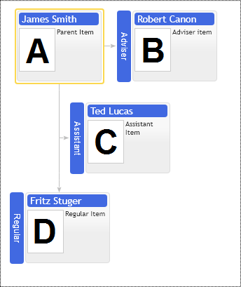

# Custom Placement of Children
## Adviser & Assistant Item Types:

The organizational chart structure is a regular tree. That means that every node can only have one logical parent in the hierarchy. That makes the organizational chart conceptually easy to work with for the end-user who edits the organizational chart and the software developer to maintain the database's required structures and the application.

In reality, pure hierarchical relations are rare. So in our organizational chart, we provide the means to represent non-hierarchical relations by using different child item types and on-screen annotations.

The component has the following child positions in diagram layout relative to the parent node:
* Regular
* Adviser
* Assistant
* Sub Adviser
* Sub Assistant
* General Partner
* Limited Partner
* Adviser Partner

All of them affect child placement relative to its parent in the hierarchy. The following example demonstrates  Adviser and Assistant types. The adviser item is placed at the same level as its parent and connected to it horizontally. The assistant occupies the row between the parent and all other regular children. It has a horizontal connection to the vertical line going from the parent to the remaining children.

Use the `adviserPlacementType` option to place an adviser or assistant on the parent's node hierarchy's left or right side.

Use the `levelOffset` option to arrange assistants into multiple rows. See the regular children layout sample.

[JavaScript](javascript.controls/CaseAdviserAndAssistantItemTypes.html)

## Sub Adviser & Sub Assistant item types

Sub Adviser & Sub Assistant item types are variations of regular Adviser & Assistant types. The only difference is that they shifted one level down relative to their original position.

Use the `adviserPlacementType` option to place them on the parent's hierarchy's left or right side.

[JavaScript](javascript.controls/CaseSubAdviserAndSubAssistantItemTypes.html)

## Adviser child nodes placement above parent's node children

If the adviser node has children, then they can be placed side by side with parents children or above them. You can choose the adviser's children's placement with the `placeAdvisersAboveChildren` option. If you set it to false, control would place advisers and the parent's children at the same row of the diagram. See Cross -Branch alignment for more options.

[JavaScript](javascript.controls/CasePlaceAdvisersAboveChildren.html)

## Assistant child nodes placement above parent's node children
If the assistant node has its children, then control pushes the parent's children down, placing assistant children at rows above the parent's children. You can alter this layout schema with the `placeAssistantsAboveChildren` option. If you set it to false, then the parent's and assistant's node children would be rendered side by side at the same level. 

[JavaScript](javascript.controls/CasePlaceAssistantsAboveChildren.html)

