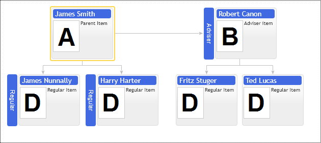

# Custom Placement of Children
## Adviser & Assistant Item Types:

Organizational Charts are structured in the form of a regular tree. This means that every node can only have one logical parent in the hierarchy. This makes the organizational chart conceptually easy to work with for the end user who edits the organizational chart and for the software developer that has to maintain the required structures in the database and in the application.

In reality, pure hierarchical relations are rare. So in our organizational chart we provide the means to represent non-hierarchical relations in form of different item types and on-screen annotations.

The chart is able to represent the following child positions in diagram layout relative to parent node:

* Regular
* Adviser
* Assistant
* Sub Adviser
* Sub Assistant
* General Partner
* Limited Partner
* Adviser Partner

All of them affect child placement relative to its parent in hierarchy. The following example demonstrates  Adviser and Assistant types. Adviser item placed at the same level as its parent and connected to it horizontally. Assistant item is placed at level between parent and its regular children and horizontally connected to connection line between parent and its children as well.

Use `ItemConfig.adviserPlacementType` option to place adviser or assistant on the left or right side of hierarchy;
Use `ItemConfig.levelOffset` option to place assistants into multiple rows. See children layout samples.

[JavaScript](javascript.controls/CaseAdviserAndAssistantItemTypes.html)

## Sub Adviser & Sub Assistant item types

Sub Adviser & Sub Assistant item types are variations of regular Adviser & Assistant types. The only difference is they are shift down one level relative to their parents, so they are connected by their top side to the hierarchy.

Use `ItemConfig.adviserPlacementType` option to place them on the left or right side of parent's hierarchy as well.

[JavaScript](javascript.controls/CaseSubAdviserAndSubAssistantItemTypes.html)

## Adviser child nodes placement above parent's node children

If adviser node has its own children then control adds extra levels, so advisers children are placed one level above of the regular children. This behavior can be altered with `placeAdvisersAboveChildren` property. So parent's node and advisers node children would be rendered side by side at the same level.

[JavaScript](javascript.controls/CasePlaceAdvisersAboveChildren.html)

## Assistant child nodes placement above parent's node children

If assistant node has its own children then control adds extra levels, so assistant's children are placed one level above of the regular children. This behavior can be altered with `placeAssistantsAboveChildren` property. So parent's node and assistants node children would be rendered side by side at the same level.

[JavaScript](javascript.controls/CasePlaceAssistantsAboveChildren.html)

