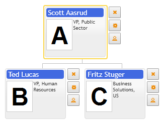

# Buttons panel

Organizational chart provides simple API to create custom user buttons. They are defined in primitives.orgdiagram.Config.buttons collection, of type primitives.orgdiagram.ButtonConfig. The option primitives.orgdiagram.Config.hasButtons allows to make buttons visible only for current cursor item or for all normal items in diagram. The same option primitives.orgdiagram.ItemConfig.hasButtons in item controls buttons visibility for individual items.

Buttons can be customized per item template. See Item template example in this section.

[JavaScript](javascript.controls/CaseButtonsPanel.html)
[JQuery](jquery.widgets/CaseButtonsPanel.html)

