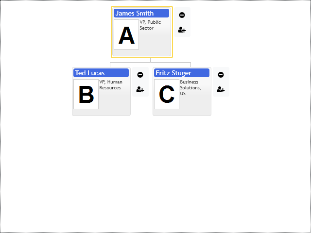

# Buttons panel

The organizational chart provides API to create a custom context buttons panel. The option `OrgConfig.hasButtons` allows making context panel visible only for the current cursor item or for all visible nodes in the diagram. The same properties exist in `TemplateConfig.hasButtons` and `OrgItemConfig.hasButtons`. They allow setting buttons panel visibility for individual items and templates.

[JavaScript](javascript.controls/CaseButtonsPanel.html)

