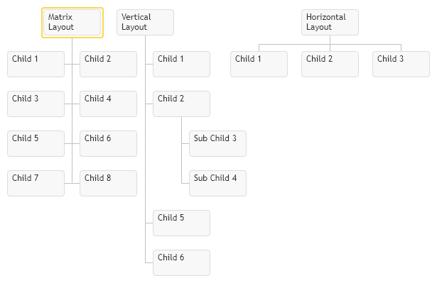

# Children Layout
Children Placement Layout can be defined individually per item or globally for all chart items. Following chart and item config properties are used to define layout of children:

* `childrenPlacementType` - this property is available for chart and for individual items, it defines shape of children with enumeration `primitives.common.ChildrenPlacementType` it provides following options `Vertical`, `Horizontal` & `Matrix`
* `leavesPlacementType` - this option is available only at global chart level and it is used to control children layout having no sub children, so it is only for children of the last level in hierarchy.
* `maximumColumnsInMatrix` - by default children in matrix are shaped into square, in order to form them into rectangular shape you have to limit maximum number of columns in matrix, so rectangular shape would grow vertically.

[JavaScript](javascript.controls/CaseChildrenPlacementType.html)
[JQuery](jquery.widgets/CaseChildrenPlacementType.html)

# Placing children into multiple horizontal levels
Children nodes can be placed into multiple rows with `levelOffset` property. Child nodes would be grouped by that property and placed in rows. Only the last row of children is effected by `childrenPlacementType` property setting their formation.

[JavaScript](javascript.controls/CaseChildNodeLevelOffset.html)
[JQuery](jquery.widgets/CaseChildNodeLevelOffset.html)