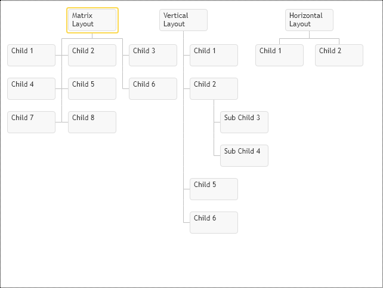

# Children Layout
Children Placement Layout can be defined individually per item or globally for all chart items. Following chart and item config properties are used to define the layout of children:

* `childrenPlacementType` - this property is available for chart and for individual items, it defines shape of children with the `primitives.ChildrenPlacementType` enumeration, which has following options `Vertical`, `Horizontal` & `Matrix`
* `leavesPlacementType` - this option is available only at the global chart level. It controls children's layout with no own children, so it is only for children of the hierarchy's last level.
* `maximumColumnsInMatrix` - by default, matrixed children form square formation. If square formation grows beyond the screen's width, it becomes inconvenient since the end-user needs to scroll that matrix both vertically and horizontally. Use this option to limit the maximum number of columns so that matrix would grow vertically only.

[JavaScript](javascript.controls/CaseChildrenPlacementType.html)

# Placing children into multiple horizontal levels
To programmatically place children nodes into multiple rows, use the `levelOffset` property. Child nodes would be grouped by that property and placed in rows. If level offsets defined for children have gaps, then the control would preserve empty row, so different branches and teams of the same organizations would be properly aligned.  See the matrixed layout demo for the matrixed team structure in the organization.

If you use the `levelOffset` property, then the children's last row is only shaped into matrixed or vertical formation by the `childrenPlacementType` property setting. 

[JavaScript](javascript.controls/CaseChildrenAndAssistantsLevelOffset.html)
