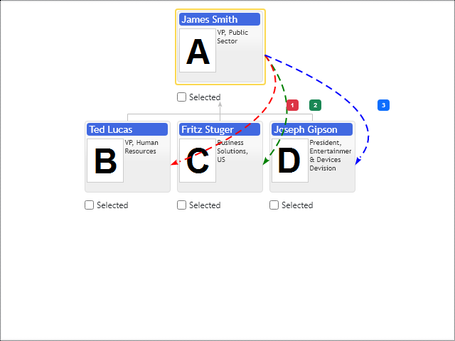

# Connector Annotations

Connector annotation is on screen direct connection line between two nodes of diagram. It supports simple conflict resolution, if multiple connections defined between the same pair of nodes, control offsets them and draws them in parallel. The following sample demonstrates connection annotation drawn in offbeat style, this way connection annotation should not overlap diagrams base connection lines:

[JavaScript](javascript.controls/CaseConnectorAnnotation.html)

