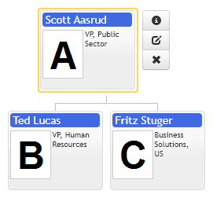
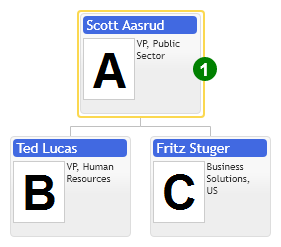
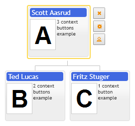

# Cursor template controls
The general idea about cursor template is to provide convenient API to place context control panel as close to the cursor node as possible. The conventional approach is to place control panel on the side of the diagram and change its content as user selects new cursor item, this approach takes a cut of screen space out of the diagram layout. The similar approach is to draw context menu panel on top of the diagram on the side of the selected node, but this will obstruct view of other diagram nodes. The compromise design is to expand space around cursor node and place context controls into that space, so cursor template provides padding option to preserve that required space around cursor node.

User controls in cursor item template plays a role of in-layout annotation, non-blocking neighboring items in chart. In case when every normal item is supposed to have UI controls then item template should be customized instead. Use z-index style attribute to layer controls properly.

Every time we change cursor node control recalculates layout, so this slows down rendering of large diagram. Our design view on this problem is to limit number of simultaneously shown nodes in diagram. Control provides default mechanism to reduce nodes into dots, but general approach is to replace groups of diagram nodes with single node and expand them as user moves cursor close to them. This kind of design approach is implemented in Dynamic Data Loading demo.

The following example demonstrates how to create Bootstrap vertical buttons group in cursor template:

1. Don't use buttons collection option of organizational chart you have create them yourself in cursor or item template.
2. Create cursor template and add bootstrap buttons group to it. http://twitter.github.com/bootstrap/
3. Create event handler for onMouseClick event.

[JavaScript](bootstrap.styles/CaseCursorTemplateAndTwitterBootstrap.html)

## Custom cursor template border
This example demonstrates how to create custom cursor border color and tag element.

Control defines templates in object of type: `primitives.orgdiagram.TemplateConfig`, this object provides options to customize separately item contents, item cursor & item highlight using following options: itemTemplate, highlightTemplate, cursorTemplate. If option is not defined chart uses default template and render for it. Every template object is referenced by its name option, it should be unique string value. Use templateName option of ItemConfig to change template name for individual item. In order to make some template object default for all items in your chart you have to set its name to defaultTemplateName options of chart config.  So again every template objects provides separate HTML fragments and renders to customize item contents, highlight and cursor.

The following example demonstrates how to create custom cursor template:

[JavaScript](javascript.controls/CaseCursorTemplate.html)
[JQuery](jquery.widgets/CaseCursorTemplate.html)

## Cursor template having item specific context buttons

This example demonstrates how to create item specific context buttons using cursor template. Ideally we have to create individual template for every item type and render buttons depending on template name, for simplicity we added an extra property called buttonsType to every item and use it to render different sets of buttons in cursor. This case is really rare and means that display collection of buttons depends on large set of items options.

[JavaScript](javascript.controls/CaseButtonsInCursorTemplate.html)
[JQuery](jquery.widgets/CaseButtonsInCursorTemplate.html)

