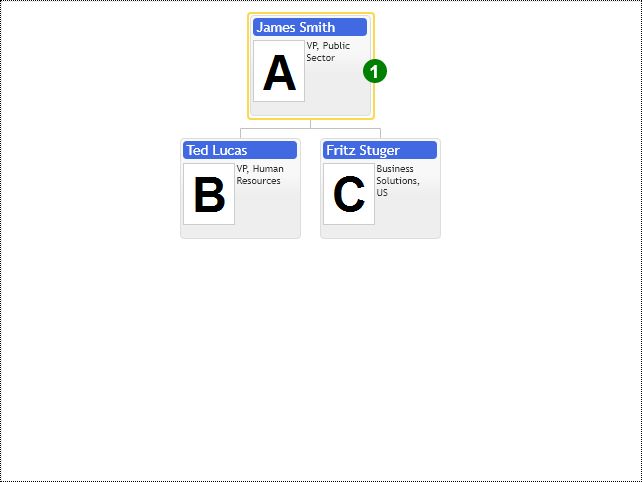

# Cursor template controls
The cursor template's general idea is to provide a convenient API to place the context control panel as close to the current cursor node as possible. The conventional approach is to put the control panel on the diagram's side and change its content as the user selects a new cursor item. That approach cutoff screen space out of the diagram layout. A similar approach is to draw a context menu panel on top of the diagram on the selected node's side, but this will obstruct other diagram nodes' view. The compromise design expands space around the cursor node and places context controls into that space, so the cursor template provides a padding option to preserve that required space around the cursor node.

User controls inside the cursor item template serve as the in-layout annotation, non-blocking neighboring items in the chart. If you consider adding the same UI elements into every visible node, then you need to customize the item template instead. 

Use the z-index style attribute to layer controls properly so other diagram visuals do not block them.

Every time we select a cursor node, the control recalculates the layout, which takes time. The component has many optimizations in this regard. If nothing helps, use dynamic nodes loading, limiting the total number of simultaneously layout nodes.  See the Dynamic Data Loading demo. We permanently show only the top three levels or the diagram and dynamically load and discard nodes in all other rows as the end-user enters and leaves them.

## Custom cursor template border
This example demonstrates how to create custom cursor border color and the Tag UI element.

The component defines templates with the `TemplateConfig` configuration object. This object provides options to customize item content, cursor & highlight templates separately. 
* `itemTemplate`
* `highlightTemplate`
* `cursorTemplate`

If you don't define some of these options, the chart uses a built-in default template and a rendering function instead. Every template object must have the `name` property set. It should be a unique string value across all templates used in the component. Use the `templateName` option of the ItemConfig configuration object to change the template name for an individual item. To make some template default for all items in your chart, you have to set its name to the `defaultTemplateName` option of the chart configuration object.  Again, every template object provides separate HTML fragments and rendering functions to customize item contents, highlight, and cursor.

The following example demonstrates how to create the custom cursor template:

[JavaScript](javascript.controls/CaseCursorTemplate.html)

