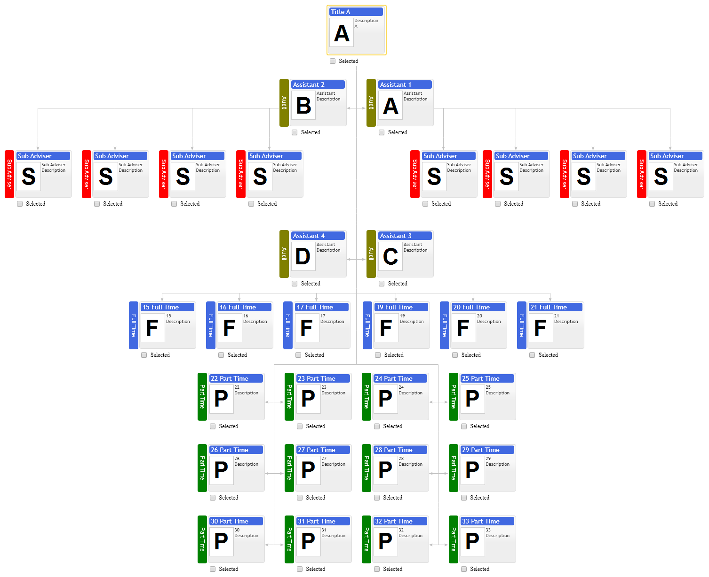
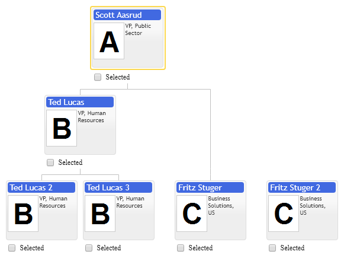

# Custom layout with Invisible items
Chart navigation is defined by parent-children relations between items. When we select cursor item, all its children and parents displayed in full size, so user can continue navigation further down or up in hierarchy. When child or parent are invisible we display children of child or parents of parent in full size as well. This feature combined with custom item types and children layouts provides great flexibility for children layout.

Following example demonstrates how to use invisible items to display multiple groups of children attached to one parent item. It has two rows of assistants and two levels of children. In order to implement this layout we create two invisible items of regular item type and make them invisible with setting option isVisible to false. Children of invisible items logically belong to their parent in our case it is root item of organizational chart, so when cursor is set to root item all items in chart become selected and displayed in full size, so user may navigate to any of them directly.

See custom item types, children layout and inactive items samples as well. 

[JavaScript](javascript.controls/CaseCustomLayoutWithInvisibleItems.html)
[JQuery](jquery.widgets/CaseCustomLayoutWithInvisibleItems.html)

## Skipped Levels

Invisible items can be used to skip levels in organizational chart. This is actually workaround, invisible items occupy space, so they can be used to shift children items down one level relative to their parents. See primitives.orgdiagram.ItemConfig.isVisible option.

[JavaScript](javascript.controls/CaseSkippedLevels.html)
[JQuery](jquery.widgets/CaseSkippedLevels.html)

