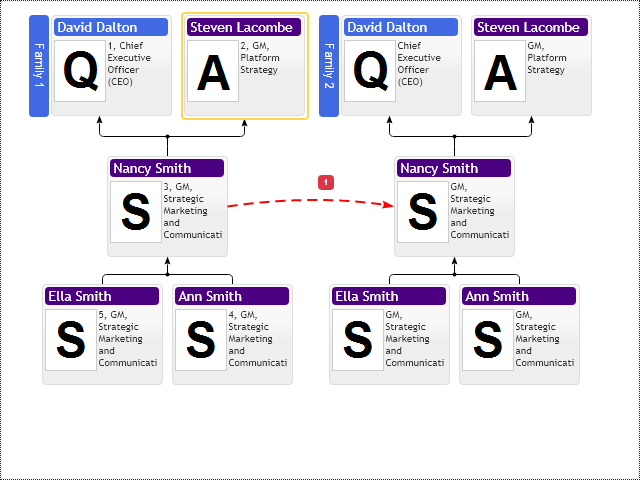
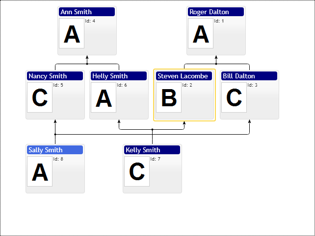

# Family Items Ordering
Family Diagram supports multiple parents and children per node, so there is no deterministic way to define groups of items and their order in group, so Family diagram provides non-deterministic API to order items. That means if items expected to be in one layout group then user can use following properties to guide layout engine about user preferred relative order of items:

1. `relativeItem` - item position and placement type defined relative to this property referenced item
2. `placementType` - item placement on the left or right side of relative item. Property has following values:
    * `primitives.AdviserPlacementType.Left`
    * `primitives.AdviserPlacementType.Right`
3. `position` - if several items reference the same `relativeItem` and placement then this `position` property defines order of them.

If item has no relative item defined then layout engine will try to find optimal placement for it based on its relations.

Please, pay attention that loops in references are completely ignored, so don't create mutual references between items.

Family Items Ordering Sample

[JavaScript](javascript.controls/CaseFamilyChartItemsOrdering.html)

## Multiple Families Ordering Sample

[JavaScript](javascript.controls/CaseMultipleFamiliesOrdering.html)

## Primary Parent

If node has multiple parents and they belong to distinct branches of the diagram then `primaryParent` property can give higher priority to one of them. So child node will be placed into hierarchy of that primary parent node.

`primaryParent` - control placed node to the hierarchy of the primary parent, this property is ignored if parent does not exists.

[JavaScript](javascript.controls/CaseFamilyChartPrimaryParent.html)

