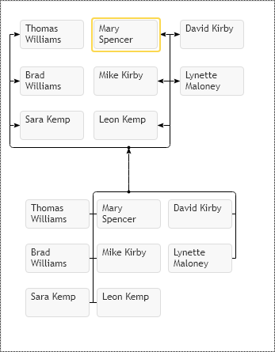

# Family Connectors Visualization
The core difference between the Family diagram and Organizational Chart is the support of multiple parents. This feature derives a lot of complexity and problems. If we look at the organizational chart, we may see that connection lines play no role in the visualization. We don't need to visually trace connection lines between nodes with our eyes to understand their mutual relations. This fact dramatically simplifies the reading of the diagram. The relative node placement on a hierarchical chart, additional spaces between branches, gives a strong visual indication of mutual relations between nodes. When we look at family diagrams supporting multiple parents, this is not the case anymore. Connectors are not secondary elements anymore, now they provide information about relations between nodes, and their excessive number creates visual clutter in the diagram, which makes their visualization virtually useless.  Look at the following example of the complete bipartite graph. It has every parent node connected with every child node.

The complete bipartite graph is an extreme example of family relations. Still, in the case of support of the multiple parents, it is a valid use case, so to eliminate this connection lines mass and make relations more understandable, the control automatically groups connectors into bundles, so it produces the following set of links: 

[JavaScript](javascript.controls/CaseFamilyChartRelations.html)

This visualization is better, but it uncovers another problem. Many parents and children do not let us see them together within screen boundaries, so to make the diagram more compact, our component supports the clustering of the nodes into matrixed formation to occupy the least space possible. To enable nodes clustering into matrixed shape, set the enableMatrixLayout option to true.

[JavaScript](javascript.controls/CaseFamilyChartMatrixLayout.html)
[PDFKit](pdfkit.plugins/FamilyMatrix.html)

Another typical problem in connectors visualization is excessive grandparents relations. It is the situation when an item has direct links to all its grandparents. Usually, when we draw the family diagram, we are more interested in showing dependencies over actual relations. We know that the grandparent precedes the parent, the great grandparent precedes the grandparent, and so on.  So this precedence defines the indirect link between the child node and grand-grandparent. So direct relation visualization between the child node and its grandparents can be omitted from the diagram and replaced with dynamic annotations. Look at the following example where every child references all preceding parents:

[JavaScript](javascript.controls/CaseFamilyChartGrandParentsRelations.html)

As you may see, the control already eliminated many connections via making bundles, so we don't see every connection between nodes, but still, this diagram has a lot of connections to trace. To hide direct connections to grandparents, set option the hideGrandParentsConnectors to true and get the following layout:

[JavaScript](javascript.controls/CaseFamilyChartHiddenGrandParentsRelations.html)
[PDFKit](pdfkit.plugins/HideGrandParentsConnectors.html)

So we got a relatively clean relations diagram between nodes. We still have all relations in place. The only difference is that grandparent's connections go through actual parents, so we need to visualize them dynamically with highlight path annotations. As we browse the diagram nodes, we can highlight all directly linked parents and children with Connector Path Annotations and set dynamically custom Item Template for them.