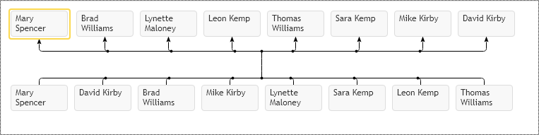
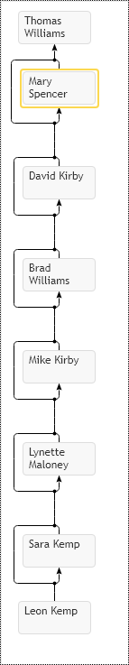

# Family Connectors Visualization
The core difference between Family diagram and Organizational Chart it is support of multiple parents. This feature derives a lot of complexity and problems. If we look at orgDiagram we may see that connection lines are basically playing no role in the visualization, we don't need to visually trace connection lines between nodes in order to understand their mutual relations. This fact greatly simplifies reading of diagram. The relative nodes placement on hierarchical diagram, additional spaces between branches gives strong visual indication of mutual relations. When we look at family diagram supporting multiple parents this is not the case anymore. Connectors are not secondary elements anymore, now they do provide information about relations between nodes and their excessive number creates visual clutter in diagram, which makes their visualization virtually useless.  Look at the following example of complete bipartite graph. Complete means situation when every node in the top layer is connected to every node in the bottom layer.

This is definitely extreme example of family relations, but the fact that famDiagram supports multiple parents, makes this usage scenario possible. In order to eliminate this connection lines mass and make relations more understandable the widget automatically groups connectors into bundles so it produces following set of relations: 

[JavaScript](javascript.controls/CaseFamilyChartRelations.html)

This visualization is better, but it shows another problem. The big number of parent and children elements does not let to see them together, so in order to make diagram more compact widget API supports clustering of nodes into matrix, so that way they occupy least space possible. In order to enable this layout option set `enableMatrixLayout` to `true`.

[JavaScript](javascript.controls/CaseFamilyChartMatrixLayout.html)
[PDFKit](pdfkit.plugins/FamilyMatrix.html)

Another typical problem in connectors visualization is excessive grand parents relations. It is situation when item has direct relation to parent, grand parent and grand grand parent. Usually when we draw family diagram we are more interested to show order of dependencies over actual relations. We know that the great-grandparent precedes the grandparent, the grandparent precedes the parent, the parent precedes the child node.  So this precedence defines the indirect relation between child node and grand-grandparent. So direct relation visualization between child node and its grand parents can be omitted out of diagram and replaced with dynamic annotations. Look at the following example where every child references all preceding parents:

[JavaScript](javascript.controls/CaseFamilyChartGrandParentsRelations.html)

As you may see control already eliminated a lot of connections via making bundles, so we don't see every connection between nodes, but still this diagram has a lot of connections to trace. In order to hide direct connections to grand parents set option `hideGrandParentsConnectors` to `true` and get following layout:

[JavaScript](javascript.controls/CaseFamilyChartHiddenGrandParentsRelations.html)
[PDFKit](pdfkit.plugins/HideGrandParentsConnectors.html)

So we got quite clean relations diagram between nodes. We still have all relations in place, the only difference is that grand parents connections go through actual parents, so we need to visualize them dynamically, as we navigate around our diagram we can highlight all current node immediate parents and children with Connector Path Annotations and set dynamically custom Item Template for them.