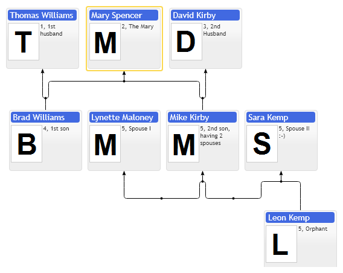

# First Family Chart

Family diagram shares a lot of common features with organizational chart diagram. See following organizational chart samples for details:

* "First Organizational Chart" - describes how to create, update and destroy widgets.
* "Adding new items at run time" - explains how to add new items to diagram without full recreation of layout.
* "Placement and auto sizing" - explains how to size diagram on page resize
etc.

The main difference of family diagram compared to organizational chart is support of multiple parents. Organizational chart is defined with a regular tree structure of items, where every branch is independent, so it makes possible to place children to custom locations relative to to its parent and group children into various shapes. It is possible in organizational chart since its nodes have no logical connections between branches. If we look at family diagram where every item may belong to multiple parents, there is no such thing as single parent anymore, so it is impossible to define children shape layout in parent node, since it create ambiguity in API. So organizational chart is simple tree structure enhanced with layout customizations, so if your data has distinct core tree structure then we recommend you to stay within organizational chart API functionality as long as possible. Your chart structure is going to be simple to understand to end users. Organizational chart provides limited multiple parents support with partner item types, it provides on screen annotations to show relations between various branches of your tree, it supports multiple root items, so you can place multiple organizational charts side by side and imitate multiple inheritance for some extend.  If we have situation when our data have multiple parents equal in logical value then it makes sense to switch to family diagram. So Family diagram supports multiple parents but it lacks usage of custom item types. Family diagram supports shaping of nodes having common set of parents and children into matrix.

Family diagram provides some features specific to multi-parent layout, for example it supports in-layout "Labels cascades" over connections between parents and children.

[JavaScript](javascript.controls/CaseFirstFamilyChart.html)
[JQuery](jquery.widgets/CaseFirstFamilyChart.html)
[PDFKit](pdfkit.plugins/FirstFamilyChart.html)

