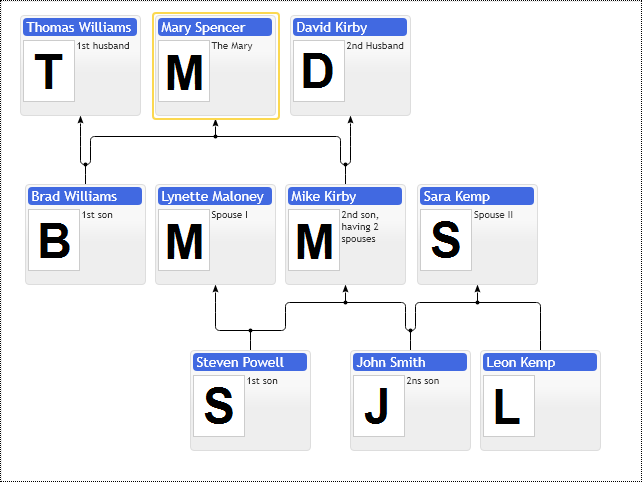

# First Family Chart for JavaScript

First of all, the Family diagram is not the best name for the control. It is a layered dependencies visualization component, supporting multiple parents and loops in nodes relations. 
The family diagram shares a lot of features with the organizational chart diagram. See the organizational chart specific samples:
* First Organizational Chart - describes how to create, update and destroy controls.
* Adding new items at run-time - explains how to modify diagram items collection.
* Placement and auto-sizing - shows how to resize diagram on page resize
* Etc.

The main difference of the family diagram compared to the organizational chart is the support of multiple parents. The organizational chart uses a regular tree structure of items, where every item has a reference to the single logical parent. Every branch of the tree structure is independent, so it is possible to place children in custom locations relative to their parents and group children into various formations. 

Now, let's look at the family diagram where every item may belong to multiple parents. There is no such thing as a single parent anymore, so it is impossible to define child placement relative to its numerous parents. So the organizational chart is a simple tree structure enhanced with layout customizations. If your data is a tree structure, we recommend staying within the Organizational chart API functionality as long as possible. Your chart structure is going to be simple to understand for end-users. The organizational chart provides limited multiple parent's support with partner item types. It provides on-screen annotations to show non-hierarchical relations between nodes of your tree. It supports numerous root items to place multiple organizational charts side by side, so you can define relations between several hierarchies within a single diagram or display broken tree structure having missing parent references. 

It would be best if you considered using the family diagram API in cases where the node's parents are equal in value when there is no significant difference in which parent of your node has higher priority.  So the Family diagram supports multiple parents, but it lacks usage of custom item types. The family diagram can shape a group of nodes having a shared set of parents and children into the matrix formation. Still, you cannot specify the children's layout for the specific parent.

The family diagram provides some features specific to multi-parent layout, not available in the organizational chart. For example, it supports in-layout cascades of labels over connections between parents and children. 

You can guide the family diagram control on how to order nodes in layout relative to each other. You can define the preferred parent node when it is impossible to place the node equally close to its parents. This layout hints help you define logical relations between nodes of the family diagram, so it does not change layout dramatically every time we add a new node into it. 

The following is the copy-paste of the "First Organization Chart" sample, but for the family diagram. See the organizational chart sample for more technical details.

[JavaScript](javascript.controls/CaseFirstFamilyChart.html)
[PDFKit](pdfkit.plugins/FirstFamilyChart.html)

