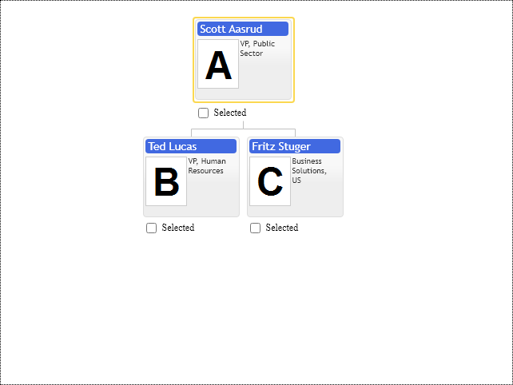

# First organizational chart

Basic Primitives diagramming component library implemented in JavaScript without dependencies on 3d party libraries and frameworks. It renders diagrams in browsers optionally using SVG, Canvas and HTML templates. By default it provides very basic node template which you can see in the following example. It serves only one purpose to make first time user experience as simple as possible, software engineer is supposed to provide nodes having basically only id, name and parent id defined, so it is enough to render first diagram.

Basic Primitives controls use existing HTML elements as placeholders on the web page to draw diagrams. The only HTML element which can serve as a placeholder is div. When you resize placeholder chart will not update its content automatically, it will not shrink or expand in size, in order to have the chart adopt to the new placeholder size you have to explicitly call "update" method on its API. In order to create or update diagram you have to pass configuration object or set individual options on its API and then call "update" method to apply changes. The configuration object consists of options and collections of various objects like items, annotations, etc., the API objects are referenced by unique ids. For convenience, all configuration objects are based on their own JavaScript prototype, so you can instantiate them and browse their default properties. Since we are in JavaScript world, all configuration objects can be defined in form of regular JSON objects as well.

## NPM package
Basic Primitives Diagrams for JavaScript [npm](https://www.npmjs.com) package name is [basicprimitives](https://www.npmjs.com/package/basicprimitives). The package contains transpiled [`UMD`](https://webpack.js.org/configuration/output/) and non-transpiled [`ES6`](https://developer.mozilla.org/en-US/docs/Web/JavaScript/Guide/Modules) modules at the same time.


```shell
npm install basicprimitives
```

or 

```shell
yarn add basicprimitives
```

```JavaScript
import { OrgDiagram, OrgConfig, OrgItemConfig ... } from 'basicprimitives';
import('basicprimitives/css/primitives.css');
```

```HTML
<script type="text/javascript" src="primitives.js"></script>
<link href="primitives.css" media="screen" rel="stylesheet" type="text/css" />
```
## JavaScript Controls

Library has two Controls `OrgDiagram` for Organizational Diagrams and `FamDiagram `for Family Diagrams creation. The following code snippet creates organization chart inside empty `div` having `basicdiagram` id:

```Javascript
var control = primitives.OrgDiagram(document.getElementById("basicdiagram"), {
  /* regular JSON object or instance of primitives.OrgConfig class*/
});
```

Please, keep reference to returned control instance, you need it to update controls options:

```Javascript
control.setOptions({"items", [
    new primitives.OrgItemConfig({
        id: 0,
        parent: null,
        title: "James Smith",
        description: "VP, Public Sector",
        image: "../images/photos/a.png"
    }),
    new primitives.OrgItemConfig({
        id: 1,
        parent: 0,
        title: "Ted Lucas",
        description: "VP, Human Resources",
        image: "../images/photos/b.png"
    }),
    new primitives.OrgItemConfig({
        id: 2,
        parent: 0,
        title: "Fritz Stuger",
        description: "Business Solutions, US",
        image: "../images/photos/c.png"
    })
]
});
```
or for individual option

```Javascript
control.setOption("cursorItem", 0);
```
every time we make changes to the control's API we need to call explicitly `update` method. This is needed in order to avoid triggering layout updates on every property change.

```Javascript
control.update(primitives.UpdateMode.Refresh);
```

The control is state-full it keeps internal state of the visualization for the purpose of performance optimization during updates. It avoids unnecessary layout calculations and elements rendering not relevant to the changed option. 

The control is interactive component by design, so it needs to add event listeners to placeholder `div` element to handle mouse and keyboard events. So it should be properly destroyed in order to remove event listeners and avoid memory leaks in single page applications:

```Javascript
control.destroy();
```

## PDFKit

Basic Primitives library provides plugins for [PDFkit](www.PDFkit.org) (MIT License) - it is JavaScript PDF generation library for NodeJS and client side rendering in browser.

PDFKit library provides the most complete experience for rendering documents in PDF format. Basic Primitives library has two plugins for PDFkit to render Diagrams on PDF page:
* OrgDiagramPdfkit - Organizational Chart PDFkit Plugin
* FamDiagramPdfkit - Family Diagram PDFkit Plugin

Basically PDFkit Plugins are stand alone products, they share many API options with Basic Primitives Controls, but they are completely deprived of interactivity and their rendering engine uses PDFkit's library vector graphics capabilities, see PDFkit site for reference.

The following example is minimal code needed to create new empty PDF file on client side in browser using PDFkit library

```JavaScript
const PDFDocument = require('pdfkit');
const blobStream  = require('blob-stream');

// create a document the same way as above
const doc = new PDFDocument;

// pipe the document to a blob
const stream = doc.pipe(blobStream());

// add your content to the document here, as usual

// get a blob when you're done
doc.end();
stream.on('finish', function() {
  // get a blob you can do whatever you like with
  const blob = stream.toBlob('application/pdf');

  // or get a blob URL for display in the browser
  const url = stream.toBlobURL('application/pdf');
  iframe.src = url;
});
```

Basic Primitives Organizational Chart PDFkit plugin is just a rendering function, which renders diagram using PDFkit API methods:

``` JavaScript
var firstOrganizationalChartSample = primitives.OrgDiagramPdfkit({
  items: [
    new primitives.OrgItemConfig({
      id: 0,
      parent: null,
      title: "James Smith",
      description: "VP, Public Sector",
      image: photos.a
    }),
    new primitives.OrgItemConfig({
      id: 1,
      parent: 0,
      title: "Ted Lucas",
      description: "VP, Human Resources",
      image: photos.b
    }),
    new primitives.OrgItemConfig({
      id: 2,
      parent: 0,
      title: "Fritz Stuger",
      description: "Business Solutions, US",
      image: photos.c
    })
  ],
  cursorItem: null,
  hasSelectorCheckbox: primitives.Enabled.False
});

var size = firstOrganizationalChartSample.draw(doc, 100, 150);
```

Pay attention that `draw` method returns actual `size` of the rendered diagram. It is needed to calculate offset in order to place other elements of PDF document underneath of it. 

PDF document is very easy to scale to make it fit to paper size or split it into multiple pages. So we don't need to make PDF page fit into some fixed predefined paper size, but in order to avoid diagram being cut by PDF page boundaries we have to measure its size first and then create PDF page of appropriate size.

```JavaScript
var sampleSize = firstOrganizationalChartSample3.getSize();
```

`getSize` method returns diagram size, so we can create new PDF document big enough to accommodate our diagram:

```JavaScript
var doc = new PDFDocument({ size: [sampleSize.width + 100, sampleSize.height + 150] });
```

Plugin draws diagram in current PDFkit document layout transformation context, so developer can rotate, translate and scale diagrams on PDFkit document page.

Plugins are part of the Basic Primitives distribution assembly

[JavaScript](javascript.controls/CaseFirstOrganizationalChart.html)
[PDFKit](pdfkit.plugins/FirstOrganizationalChart.html)

