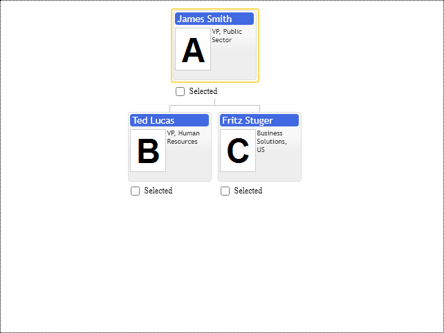

# First organizational chart for JavaScript

Basic Primitives diagramming component library is implemented in JavaScript without dependencies on 3d party libraries and frameworks. It renders diagrams in browsers  using SVG and HTML templates. By default, it provides a basic node template, which you can see in the following example. It serves only one purpose to make the first-time user experience as simple as possible. The software engineer is supposed to provide nodes structure with id, name, and parent id properties only, so it is enough to render the first diagram.

Basic Primitives controls use existing HTML elements as placeholders on the web page to draw diagrams. The only HTML element which can serve as a placeholder is div. 
When you resize the placeholder, the chart will not update its content automatically. It will not shrink or expand in size. To have the diagram fit to the new placeholder size, you have to explicitly call the "update" method on the control's API.

When you create a new diagram instance or update the existing one, you have to instantiate and pass the configuration object as a parameter to the control's class.  The configuration object is a collection of API options you can set to customize your diagram. See samples and references at this site for more details. 
Please, pay attention that you need explicitly call the "update" method to apply changes. The update method helps to avoid unnecessary rendering of the diagram for every property change. 

The control's configuration object consists of options and collections of various diagram properties like items, annotations, etc. Similar configuration objects define nodes, annotations, templates, and other diagram elements. 

Individual configuration objects must have unique ids. The control uses ids to define relations between visual elements in the diagram. 

For the sake of convenience, all configuration objects have their JavaScript prototype classes, so you can instantiate them and browse their default properties. Since we are in the JavaScript world, we can use regular JSON objects to define the diagram's configuration.

## NPM package
Basic Primitives Diagrams for JavaScript [npm](https://www.npmjs.com) package name is [basicprimitives](https://www.npmjs.com/package/basicprimitives). The package contains transpiled [`UMD`](https://webpack.js.org/configuration/output/) and non-transpiled [`ES6`](https://developer.mozilla.org/en-US/docs/Web/JavaScript/Guide/Modules) modules at the same time.


```shell
npm install basic primitives
```

or 

```shell
yarn add basic primitives
```

```JavaScript
import { OrgDiagram, OrgConfig, OrgItemConfig ... } from 'basicprimitives';
import('basicprimitives/css/primitives.css');
```

```HTML
<script type="text/javascript" src="primitives.js"></script>
<link href="primitives.css" media="screen" rel="stylesheet" type="text/css" />
```
## JavaScript Controls

The library has two controls `OrgDiagram` for Organizational Diagrams and `FamDiagram `for Family Diagrams creation. The following code snippet creates an organization chart inside empty `div` having `basic diagram` id:

```Javascript
var control = primitives.OrgDiagram(document.getElementById("basicdiagram"), {
  /* regular JSON object or instance of primitives.OrgConfig class*/
});
```

Please, keep the reference to the returned control instance. It would be needed to update controls options:

```Javascript
control.setOptions({"items", [
    new primitives.OrgItemConfig({
        id: 0,
        parent: null,
        title: "James Smith",
        description: "VP, Public Sector",
        image: "../images/photos/a.png"
    }),
    new primitives.OrgItemConfig({
        id: 1,
        parent: 0,
        title: "Ted Lucas",
        description: "VP, Human Resources",
        image: "../images/photos/b.png"
    }),
    new primitives.OrgItemConfig({
        id: 2,
        parent: 0,
        title: "Fritz Stuger",
        description: "Business Solutions, US",
        image: "../images/photos/c.png"
    })
]
});
```
or for individual option

```Javascript
control.setOption("cursorItem", 0);
```
every time we make changes to the control's API, we need to explicitly call the `update` method. The explicit update method call helps you avoid triggering layout updates on every property change.

```Javascript
control.update(primitives.UpdateMode.Refresh);
```

The control is state-full. It keeps the internal state of the visualization for performance optimization during updates. It avoids unnecessary layout calculations and elements rendering not relevant to the changed option. 

The control is an interactive component by design, so it needs to add event listeners to the placeholder `div` element to handle mouse and keyboard events. So it should be destroyed to remove event listeners and avoid memory leaks in single-page applications:

```Javascript
control.destroy();
```

## PDFKit

Basic Primitives library provides plugins for [PDFkit](www.PDFkit.org) (MIT License) - it is JavaScript PDF generation library for NodeJS and client-side rendering in browser.

PDFKit library provides the complete experience for rendering documents in PDF format. Basic Primitives library has two plugins for PDFkit to generate Diagrams on PDF page:
* OrgDiagramPdfkit - Organizational Chart PDFkit Plugin
* FamDiagramPdfkit - Family Diagram PDFkit Plugin

PDFkit Plugins are stand-alone products. They share many API options with Basic Primitives Controls, but they don't have any interactivity, and their rendering engine uses PDFkit's library vector graphics capabilities, see PDFkit site for reference.

The following example is a minimal code needed to create a new empty PDF file on the browser's client-side using the PDFkit library.

```JavaScript
const PDFDocument = require('pdfkit');
const blobStream  = require('blob-stream');

// create a document the same way as above
const doc = new PDFDocument;

// pipe the document to a blob
const stream = doc.pipe(blobStream());

// add your content to the document here, as usual

// get a blob when you're done
doc.end();
stream.on('finish', function() {
  // get a blob you can do whatever you like with
  const blob = stream.toBlob('application/pdf');

  // or get a blob URL for display in the browser
  const url = stream.toBlobURL('application/pdf');
  iframe.src = url;
});
```

Basic Primitives Organizational Chart PDFkit plugin is just a rendering function, which renders diagram using PDFkit API methods:

``` JavaScript
var sampleChart = primitives.OrgDiagramPdfkit({
  items: [
    new primitives.OrgItemConfig({
      id: 0,
      parent: null,
      title: "James Smith",
      description: "VP, Public Sector",
      image: photos.a
    }),
    new primitives.OrgItemConfig({
      id: 1,
      parent: 0,
      title: "Ted Lucas",
      description: "VP, Human Resources",
      image: photos.b
    }),
    new primitives.OrgItemConfig({
      id: 2,
      parent: 0,
      title: "Fritz Stuger",
      description: "Business Solutions, US",
      image: photos.c
    })
  ],
  cursorItem: null,
  hasSelectorCheckbox: primitives.Enabled.False
});

var size = sampleChart.draw(doc, 100, 150);
```

Pay attention that the `draw` method returns the actual `size` of the rendered diagram. It is needed to calculate offset to place other elements of PDF document underneath of it. 

PDF document has context manipulation methods setting scale, rotation, and offset of the diagram. Use them to fit the chart into the page size or split it into multiple pages. In general, we don't need to make our PDF page fit into some fixed predefined paper size. But we still need to measure diagram size first to create a PDF page capable of providing enough space for our diagram without cutting it by PDF page boundaries.
If you need to print your PDF document, Adobe PDF Reader will do the auto fit. Our diagrams use vector graphics, so it is suitable for scaling.

```JavaScript
var sampleSize = firstOrganizationalChartSample3.getSize();
```

`getSize` method returns diagram size, so we can create a new PDF document big enough to accommodate our diagram:

```JavaScript
var doc = new PDFDocument({ size: [sampleSize.width + 100, sampleSize.height + 150] });
```

Plugin draws the diagram in the current PDFkit document layout transformation context. Modify it to rotate, translate and scale your chart on the PDFkit document page.

Plugins are part of the Basic Primitives distribution package.

[JavaScript](javascript.controls/CaseFirstOrganizationalChart.html)
[PDFKit](pdfkit.plugins/FirstOrganizationalChart.html)

