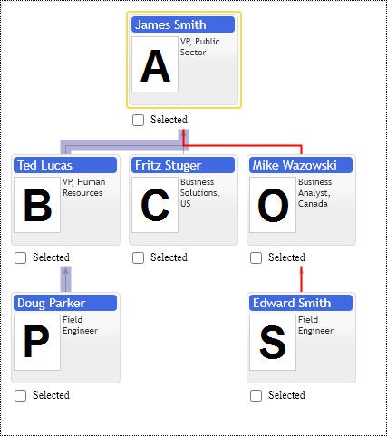
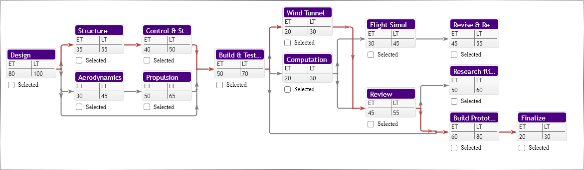

# Highlight Path Annotation

Highlight Path annotation highlights connections between group of items in hierarchy with distinct line properties. It supports only one type of highlighting and it is defined in chart's primitives.OrgConfig options class with following properties: `highlightLinesColor`, `highlightLinesWidth`, `highlightLinesType`.

[JavaScript](javascript.controls/CaseHighlightPathAnnotation.html)

## PERT - Program evaluation and review technique chart & Critical Path Visualization
PERT chart critical path visualization with Highlight Path Annotation. Chart does not provide any means to find critical path, it is user's responsibility to trace items and visualize critical path with Highlight Path Annotation. Path segments defined as sequence of nodes.

[JavaScript](javascript.controls/CasePERTChart.html)

## Routing Highlight Path Annotation for hidden grand parents connections

Connection lines are hard to visualy trace on the screen, they make sence for paper form diagrams, but bring no value for interactive diagrams, so the main point of this option is to remove redundent connection lines giving no visual value and show connected grand parents by other means, i.e. highlight path annotations and custom item templates.

[JavaScript](javascript.controls/CaseFamilyHideGrandParentsConnections.html)

