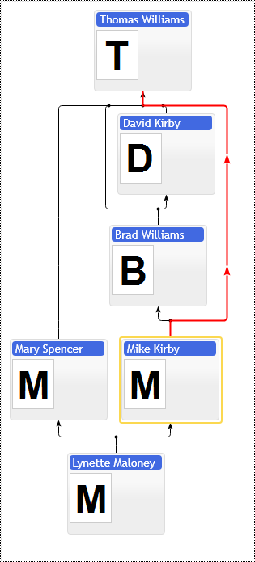

# Highlight Path Annotation

Highlight Path annotation highlights connections between a group of items in the hierarchy with distinct line properties. The highlight path  annotation supports only one type of highlighting, use the following configuration object properties to style it: `highlightLinesColor`, `highlightLinesWidth`, `highlightLinesType`.

See family diagram and organizational chart partners demos for more use usage scenarios.

[JavaScript](javascript.controls/CaseHighlightPathAnnotation.html)


## PERT - Program evaluation and review technique chart & Critical Path Visualization
PERT chart critical path visualization with Highlight Path Annotation. The chart does not provide any means to find a critical path. It is the developer's responsibility to trace items and visualize critical path with Highlight Path Annotation. The application should sequence the Critical path nodes and set them in the annotation.

[JavaScript](javascript.controls/CasePERTChart.html)


## Routing Highlight Path Annotation for hidden grandparents connections

The connection lines are hard to trace on the screen visually. They make sense for traditional paper form diagrams visualization when we have no interactivity.  But they bring no value for interactive applications, so the main point is to remove redundant connection lines giving no visual value and replace them with dynamic highlight path annotations and custom node templates for compensation.

```JavaScript
options.hideGrandParentsConnectors = true;
```

[JavaScript](javascript.controls/CaseFamilyHideGrandParentsConnections.html)

