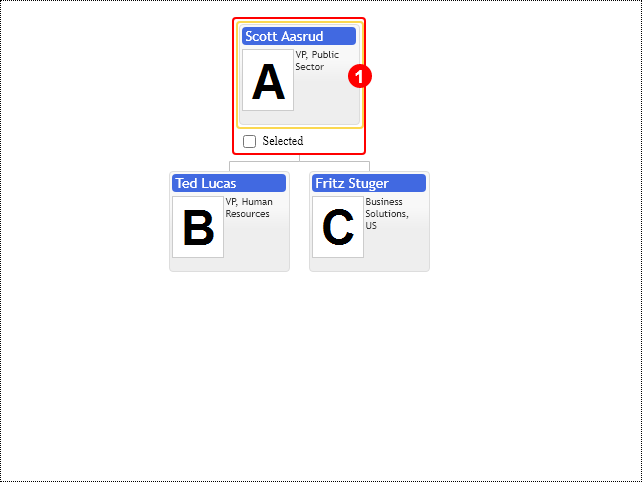

# Highlight template

Highlight element is templated as well, so it can be customized with `highlightTemplate` property of `primitives.TemplateConfig` options class. Widget's `onHighlightRender` event is called in order to provide possibility to reference HTML elements in highlight template and populate them with context specific data. See example and reference for details about event arguments.

[JavaScript](javascript.controls/CaseHighlightTemplate.html)

