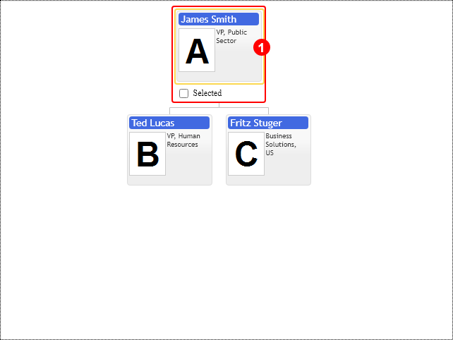

# Highlight template

The component can customize the highlight frame as well. By default, it is a regular `div` element sized and placed into position, having custom properties.  Use the `highlightTemplate` property of the `TemplateConfig` configuration class. The control calls the `onHighlightRender` event every time it renders the highlight template. You get the reference to the DOM element and the highlighted item of the diagram to populate them with context specific data. See the example and reference for details about event arguments.

[JavaScript](javascript.controls/CaseHighlightTemplate.html)

