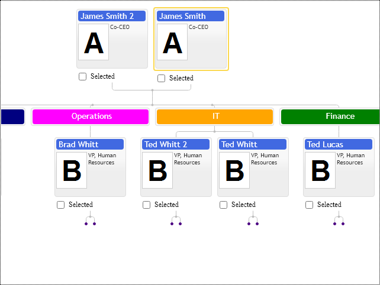

# Inactive family items
Inactive items are regular items excluded from the navigation. End-user cannot click on them and move the cursor to them. In the auto fit mode,  selecting the neighboring node next to the inactive item makes all nodes of the inactive item visible. The inactive items play a role in layout annotations having no user interaction and templated with HTML the same way as other diagram nodes. For example, we can add titles into family diagram layout to separate groups of nodes. We can add inactive terminator items indicating that the diagram would load extra nodes into the structure upon reaching them.

Control provides two ways to make nodes inactive. The first one is to set the `isActive` property of the node to false. The other one is more generic. It is where we make all nodes having some particular template inactive. An adequately structured application should have some item templates, so making stationery items with template options is the most appropriate.

See following configuration classes:

* `FamItemConfig`
* `TemplateConfig`

They have the following option:

* `isActive` - Setting it to false makes items inactive in diagram layout, so they become irresponsive to mouse and keyboard navigation events. 

If you need to disable controls interactivity, it provides global scope options to disable mouse highlights and cursor navigation.

[JavaScript](javascript.controls/CaseInactiveFamilyItems.html)

