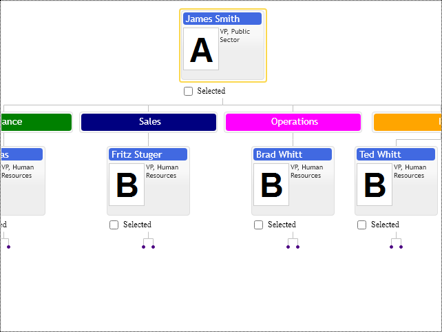

# Inactive items
Inactive items are regular items excluded from the navigation and deprived of interactivity. For example, we can add department titles into hierarchy or terminator items, indicating the number of available items for dynamic adding into the structure.

Chart's API provides two ways to set make items inactive. The first one is the `isActive` option of the ItemConfig options class and the second way is via template configuration. In most scenarios, the inactive items are supposed to have a custom item template, so deactivating user interaction via template is the most appropriate for application design. 

See following configuration classes:

* `OrgItemConfig`
* `TemplateConfig`

They have the following option:

* `isActive` - Setting it to false makes items inactive in diagram layout, so they become irresponsive to mouse and keyboard navigation events. 

If you need to disable controls interactivity, it provides global scope options to disable mouse highlights and cursor navigation.

[JavaScript](javascript.controls/CaseInactiveItems.html)

