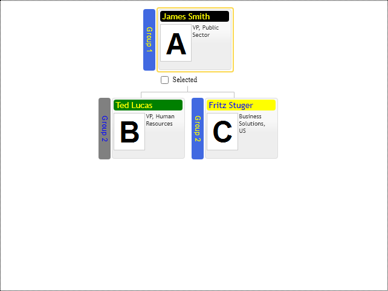

# Item & group title colors

Item's title background color may be used for grouping items in diagram and may vary in wide range of colors. at the same time title font color should be always readable on every background. So taking these considerations into account, the control allows to customize title background color for every Item with itemTitleColor property and provides means to choose the best title font color out of two options: itemTitleFirstFontColor and itemTitleSecondFontColor. The control uses `highestContrast` function to choose font color having highest contrast on item's title background. See reference.

[JavaScript](javascript.controls/CaseItemAndGroupTitleColors.html)

