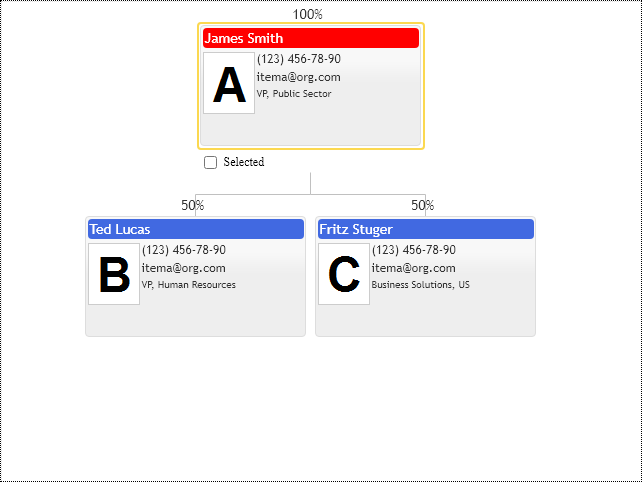

# Labels
The chart provides options to draw labels for nodes. It draws them for minimized nodes into markers only. Use the following options on the diagram configuration object to control labels styling and placement:
* `showLabels`
* `labelSize`
* `labelOffset`
* `labelOrientation`
* `labelPlacement`

See the reference for more details.

The `ItemConfig` configuration object has properties `label`,  `showLabel` etc. They let you customize labels per item. That is needed because markers have no templates for labels customization.

If we need labels for the regular visible items, we can add them to the custom template. The templates consist of HTML fragments, so it possible to place labels outside node boundaries. For that, you need to override the default CSS `overflow` attribute from `hidden` to `visible`.  See `bp-item` class in the `primitives.css` file. 

The following example demonstrates how to add an extra property showing percent value over nodes connection lines.

[JavaScript](javascript.controls/CaseItemTemplateLabel.html)

