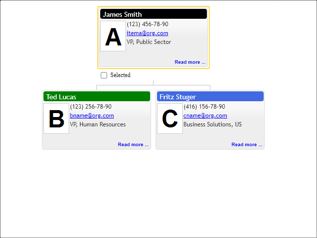
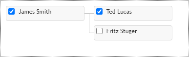

# Item template
## Supported Formats
Controls provide two distinct ways to define items templates. The original one is based on setting HTML elements content via innerHTML DOM element property, see following reference at https://developer.mozilla.org web site for more details. This very old and unregulated approach, so trivial template looks like the following:

```JavaScript
var result.itemTemplate = 
'<div>'
+ '<div name="titleBackground">'
    + '<div name="title">'
    + '</div>'
+ '</div>'
+ '<div class="bp-photo-frame">'
    + ''
+ '</div>'
+ '<div name="phone"></div>'
+ '<div name="email"></div>'
+ '<div name="description"></div>'
+ '</div>'
```
We use JSON ML to define and render default built-in templates. It is a convenient alternative to the above mentioned string-based templates. See the following website for more details http://www.jsonml.org/. That is only 3d party MIT licensed code included in our code base. Everything else is 100% authentic. We use it with minor modifications. The following code snippet demonstrates the usage of JSON ML in code. It is less compact than the previous approach, but it provides a more normalized and more secure implementation for templates definition:

```JavaScript
result.itemTemplate = ["div",
    {
        "style": {"width": result.itemSize.width + "px","height": result.itemSize.height + "px"},
        "class": ["bp-item", "bp-corner-all", "bt-item-frame"]
    },
    ["div",
        {
            "name": "titleBackground",
            "class": ["bp-item", "bp-corner-all", "bt-title-frame"],
            "style": {top: "2px",left: "2px",width: "216px",height: "20px"}
        },
        ["div",
            {
                "name": "title",
                "class": ["bp-item", "bp-title"],
                "style": {top: "3px", left: "6px", width: "208px", height: "18px"}
            }
        ]
    ],
    ["div",
        {
            "class": ["bp-item", "bp-photo-frame"],
            "style": {top: "26px",left: "2px",width: "50px",height: "60px"}
        },
        ["img",
            {
                "name": "photo",
                "class": ["bp-item", "bp-title"],
                "style": {width: "50px",height: "60px"}
            }
        ]
    ],
    ["div",
        {
            "name": "phone",
            "class": "bp-item",
            "style": {top: "26px",left: "56px",width: "162px",height: "18px",fontSize: "12px"}
        }
    ],
];
```

## Configuration Classes
We can define node content, cursor, and highlight templates in one configuration object. See TemplateConfig object reference for more details.  That makes sense since if we decide to customize cursor or highlight templates, most likely, we are going to make them per node template. The control does not require all 3 of them to be defined. If cursor or highlight templates properties equal null in the template configuration object, the control uses built-in templates instead. See the following configuration objects for template related properties:

* `OrgItemConfig`
* `FamConfig`
* `OrgConfig`
* `TemplateConfig`

## Size
The diagram layout engine works only with fixed-size nodes. So we don't support in any form nodes auto-sizing. Such feature implementation would require control to measure the content of every node before the rendering cycle. Considering that node's visibility depends on available space and space depends on node visibility, we will have an infinite loop of diagram layout and nodes measure iterations. So control expects that node size is hardcoded in the template configuration. 

## Content population
Templates should be populated with items content when rendered, so for this purpose, the control has a callback `onTemplateRender` function on the API. The component calls it for every visible node during the rendering cycle. The callback function provides context arguments to the application:
 * `data.element` - is  template instance in the DOM
 * `data.context` - is rendered context item
*  `data.renderingMode` - is `RenderingMode` enumeration. It indicates the state of the template. If rendering mode is `Update`, control reuses the existing node template in the DOM. So you always have to populate elements with null values to override existing values in the template.  
* `data.templateName` - is template name.

The control uses a built-in template rendering function if the application does not provide its own. The built-in function will use name attributes of template elements to find them and populate them with default item properties values. 

The ReactJS component uses templates only to set node sizes. ReactJS renders its templates and content itself so that you can do the same. You can define the item template as a regular empty `div'  and populate it with the `onTemplateRender` callback function.

## The root element of the template should be DIV.

```JavaScript
function onTemplateRender(event, data) {
    switch (data.renderingMode) {
        case primitives.RenderingMode.Create:
            /* Initialize template content here */
            break;
        case primitives.RenderingMode.Update:
            /* Update template content here */
            break;
    }
 
    var itemConfig = data.context;
 
    if (data.templateName == "contactTemplate2") {
        var photo = data.element.childNodes[1].firstChild;
        photo.src = itemConfig.image;
        photo.alt = itemConfig.title;
 
        var titleBackground = data.element.firstChild;
        titleBackground.style.backgroundColor = itemConfig.itemTitleColor || primitives.Colors.RoyalBlue;
 
        var title = data.element.firstChild.firstChild;
        title.textContent = itemConfig.title;
 
        var phone = data.element.childNodes[2];
        phone.textContent = itemConfig.phone;
 
        var email = data.element.childNodes[3];
        email.textContent = itemConfig.email;
 
        var description = data.element.childNodes[4];
        description.textContent = itemConfig.description;
    }
}
```

## Names
Every template configuration object has a unique name. See the `name` property of `TemplateConfig` configuration class. The diagram items use that name to set custom templates for nodes.
The `onTemplateRender` callback function handler receives template name as the option of `data.templateName` argument. If the diagram item has no template name set, it uses the default template for rendering.
If you need to override the default template for all nodes of your diagram, then use the `defaultTemplateName` property of the control configuration object.

See the following examples of templates usage:

## PDF Templates

PDFKit Plugins use the same template objects with one major exception. All rendering is done using PDFKit API:

* [Text](http://pdfkit.org/docs/text.html)
* [Images](http://pdfkit.org/docs/images.html)
* [Vector Graphics](http://pdfkit.org/docs/vector.html)

See [PDFKit](http://pdfkit.org/) site for more details.

Basic Primitives PDFkit Plugins have no HTML or browsers specific dependencies. They share API options with their coupled UI controls. The primary API difference is that they have no UI events and rendering mechanism refit to use PDFkit document API methods. The following sample shows usage of the `onTemplateRender` event handler, which receives the `doc` reference to PDFkit `PDFDocument` instance and the node `position` in the PDF document coordinates:

The developer is free to render any content in the node's position. The following sample draws a frame, photo, title and creates PDF specific link annotation, which is clickable in PDF.

```JavaScript
function onTemplateRender(doc, position, data) {
  var itemConfig = data.context;

  if (data.templateName == "contactTemplate") {
    var contentSize = new primitives.Size(220, 108);

    contentSize.width -= 2;
    contentSize.height -= 2;

    doc.save();

    /* item border */
    doc.roundedRect(position.x, position.y, position.width, position.height, 0)
      .lineWidth(1)
      .stroke('#dddddd');

    /* photo */
    if (itemConfig.image != null) {
      doc.image(itemConfig.image, position.x + 3, position.y + 3);
    }

    /* title */
    doc.fillColor('Black')
      .font('Helvetica', 12)
      .text(itemConfig.title, position.x + 110, position.y + 7, {
        ellipsis: true,
        width: (contentSize.width - 4 - 110),
        height: 16,
        align: 'center'
      });

    /* description */
    doc.fillColor('black')
      .font('Helvetica', 10)
      .text(itemConfig.description, position.x + 110, position.y + 24, {
        ellipsis: true,
        width: (contentSize.width - 4 - 110),
        height: 74,
        align: 'left'
      });

    /* readmore */
    doc.fillColor('black')
      .font('Helvetica', 10)
      .text('Link Annotation ...', position.x + 110, position.y + 94, {
        ellipsis: false,
        width: (contentSize.width - 4 - 110),
        height: 24,
        align: 'right',
        link: itemConfig.link,
        underline: true
      });

    doc.restore();
  }
}
```

[JavaScript](javascript.controls/CaseItemTemplate.html)
[PDFKit](pdfkit.plugins/UserItemTemplate.html)
[PDFKit Graphics](pdfkit.plugins/UserItemTemplateWithShapes.html)


## Adding link to Item Template
To avoid diagram cursor positioning and layout, when the end-user clicks on the web link, add 'stopPropagation' to the mouse click event handler.

```JavaScript
  readmore.addEventListener("click", function (e) {
    /* Block mouse click propagation in order to avoid layout updates before server postback*/
    primitives.stopPropagation(e);
  });
```

[JavaScript](javascript.controls/CaseAddingLinkToItemTemplate.html)



## Adding selection checkbox to Item Template
Chart supports selected items collection on its API, so the checkbox element is necessary for the control's functionality. Suppose you want to place it inside the item template instead of having it shown outside as a decorator of element boundaries. In that case, you have to add `bp-selectioncheckbox` class name to your checkbox element.

[JavaScript](javascript.controls/CaseSelectionCheckboxInItemTemplate.html)

