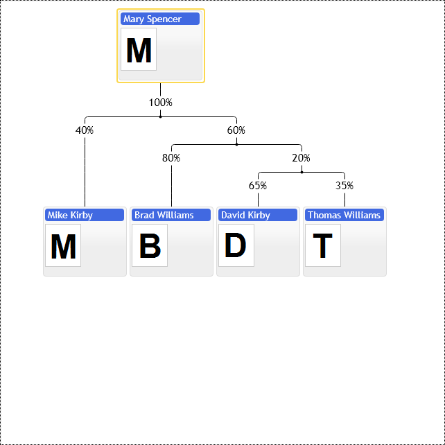

# Labels cascades over connection lines in family chart
Family chart control provides connection lines labels binding multiple nodes together. In the following example we create cascade of labels from common parent down to its children. If two labels create mutually exclusive bundles the first label wins.

See primitives.LabelAnnotationConfig for details. By default labels display regular text label, but they can be styled the same way as regular items of chart. See templateName option of LabelAnnotationConfig and  defaultLabelAnnotationTemplate of primitives.FamConfig class.

[JavaScript](javascript.controls/CaseLabelsCascadesInFamilyChart.html)

