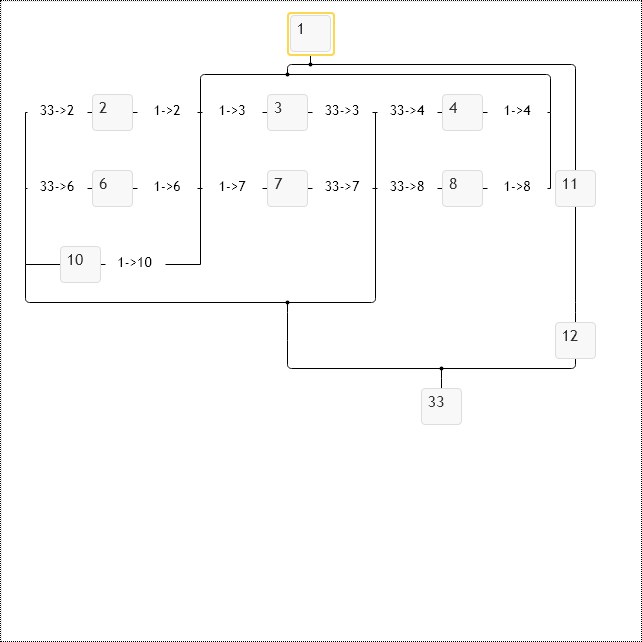

# Labels cascades over connection lines in family chart
Label annotations are family diagram specific annotations. Label annotations are placed inside the diagram layout between nodes so they don't overlap nodes, can occupy relatively large space. Still, they require the control to rerender nodes when we add label annotations to the diagram. 

Label annotations can bind multiple nodes together, so visually label annotation can define aggregate value for several nodes bundled together.  In the following example, we create a cascade of labels from the common parent down to its children. If two labels create mutually exclusive bundles, the first label wins.

See primitives.LabelAnnotationConfig for details. By default, label annotations display regular text labels, but we can use node templates to define their content. So from this perspective, they are regular diagram nodes, having complex placement logic in the diagram. See templateName option of LabelAnnotationConfig and defaultLabelAnnotationTemplate of primitives.FamConfig class.

[JavaScript](javascript.controls/CaseLabelsCascadesInFamilyChart.html)

# Labels over connection lines in matrix-shaped family chart
The following sample demonstrates how control shows labels around matrix of nodes.

[JavaScript](javascript.controls/CaseLabelsNMatrixInFamilyChart.html)

