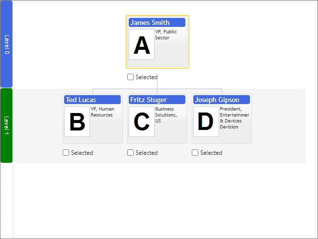

# Level Annotations

Basic Primitives Diagrams render layered hierarchies and dependency diagrams. Level annotation decorates level of nodes with title and background stripe drawn across the whole level of the diagram. Title is placed outside diagram's view area and occupies screen space. Optionally titles can be placed inside of the diagram's view area in the background:

[JavaScript](javascript.controls/CaseLevelAnnotation.html)

