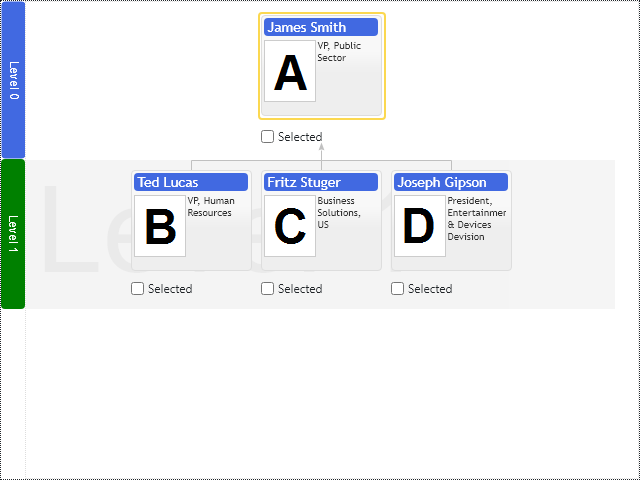

# Level Annotations

Basic Primitives Diagrams render layered hierarchies and dependency diagrams. Level annotation decorates the level of nodes with title and background stripe drawn across the diagram's whole level. The title is placed outside the diagram's view area and occupies screen space. Optionally you can place level annotation titles inside the diagram's view area in the background.

Level Annotations reference logical levels of the diagram. The first node placed into the logical level defines the level index. So if you have manager nodes vertically aligned under their CEO, you will have multiple managerial level annotations alternating with direct reports level annotations. See vertical organizational chart demo application.
The node's children types and layout options change the number of visual levels in the hierarchy; use the `alignBranches` option to align children having the same logical level at one visual level.

[JavaScript](javascript.controls/CaseLevelAnnotation.html)
[PDFKit](pdfkit.plugins/LevelAnnotation.html)

# Level Annotations Templates

Use the following options to modify level annotation default content and mouse events:

* `onLevelTitleRender` - callback function to render level title
* `onLevelBackgroundRender` - callback function to render level background

Click on the level annotation title to see a popup message.

[JavaScript](javascript.controls/CaseLevelAnnotationTemplate.html)

