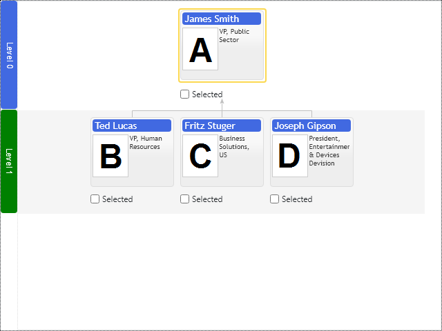

# Level Annotations

Basic Primitives Diagrams render layered hierarchies and dependency diagrams. Level annotation decorates the level of nodes with title and background stripe drawn across the diagram's whole level. The title is placed outside the diagram's view area and occupies screen space. Optionally you can place level annotation titles inside of the diagram's view area in the background.

Level Annotations reference logical levels of the diagram. The first node placed into the logical level defines the level index. So if you have manager nodes vertically aligned under their CEO, you will have multiple managerial level annotations alternating with direct reports level annotations. See vertical organizational chart demo application.

[JavaScript](javascript.controls/CaseLevelAnnotation.html)
[PDFKit](pdfkit.plugins/LevelAnnotation.html)

