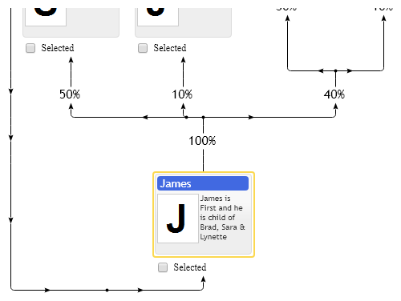

# Optimization of Loops In layered graph visualization

Configuration may contain looped references between items, so control tries to find layout minimizing number of loops between levels, so majority of references ideally should go in one direction. This optimization can be disabled so items levels order will match their order in `items` collection. For example if you have two nodes A and B referencing each other, then it is undefined which one one is going to be at the top of the diagram. Set `loopsLayoutMode` to `primitives.common.LoopsLayoutMode.KeepItemsOrder`, if you need the first item in your collection to be at the top, otherwise control will optimize loops layout and first item will depend on results of the optimization.

[JavaScript](javascript.controls/CaseLoopsInFamilyChart.html)
[PDFKit](pdfkit.plugins/LoopsInFamilyChart.html)

