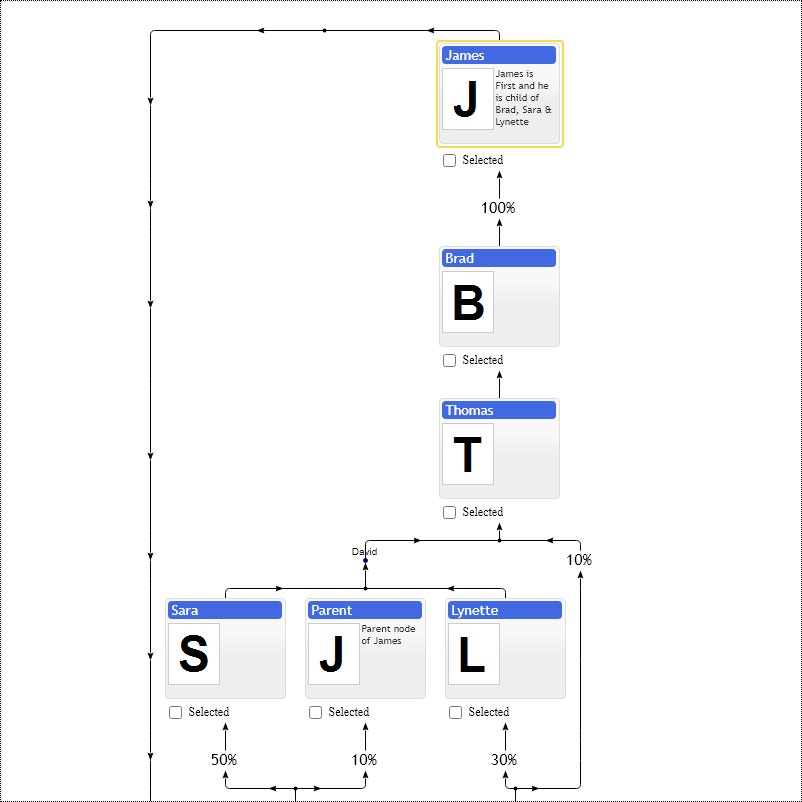

# Optimization of loops in layered graph visualization

If relations between nodes form loops, the control tries to find a layout minimizing the number of links going in the opposite direction.

[JavaScript](javascript.controls/CaseLoopsInFamilyChart.html)
[PDFKit](pdfkit.plugins/LoopsInFamilyChart.html)

