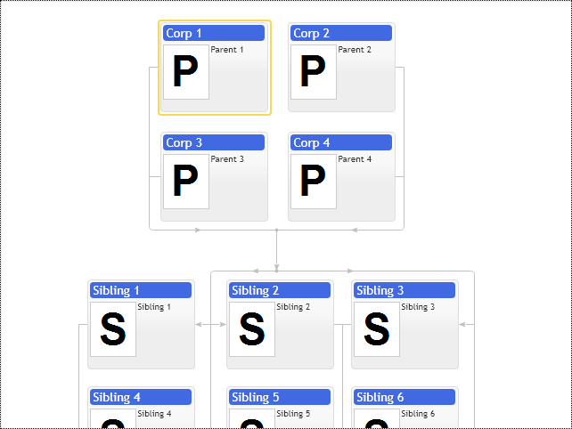
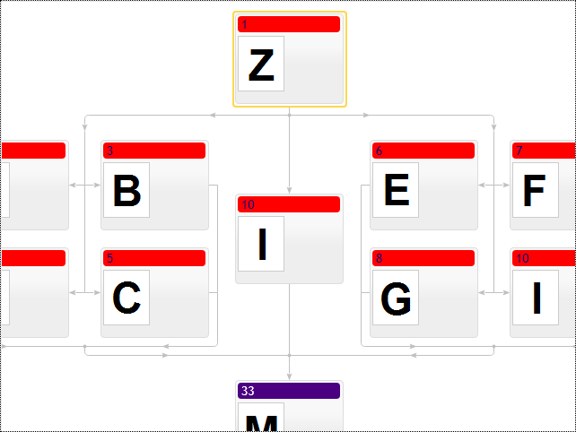

# Matrix layout in family chart
The option `enableMatrixLayout` enables automatic matrix layout for nodes sharing the same set of parents and children in the diagram. The matrix forms a square shape. If the matrix outgrows the screen width, it makes diagram navigation complicated. The `maximumColumnsInMatrix` option limits the maximum number of columns and forces the matrix to grow vertically instead of horizontally. The option `minimumMatrixSize` sets the minimum number of nodes needed to be shaped into matrix formation. 

[JavaScript](javascript.controls/CaseMatrixLayoutInFamilyChart.html)

# Grouping nodes into multiple matrixes
The family diagram provides options to control grouping nodes into matrixes per node. The option `addToMatrix` lets you explicitly prohibit adding nodes into any group of matrixed nodes. And the `matrixId` option allows you to group nodes into multiple matrixes.

[JavaScript](javascript.controls/CaseMatrixGroupsInFamilyChart.html)

