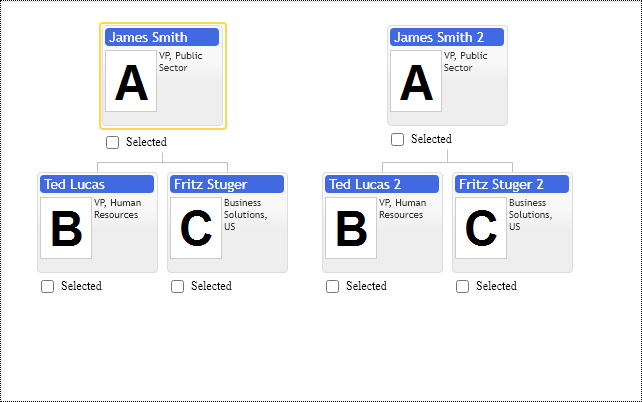
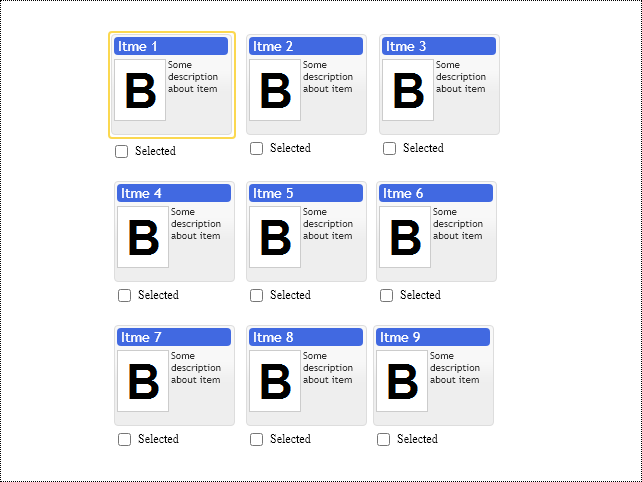

# Multiple root items in chart

Multiple root items are convenient to display multiple hierarchy fragments side by side. For example if our organizational data is incomplete and several nodes reference null parent, chart will show organization structure as it is in form of several disconnected hierarchies placed altogether in diagram.

Following example shows two disconnected hierarchies: 

[JavaScript](javascript.controls/CaseMultipleRootItemsInChart.html)

## Matrix layout of multiple root items
This is another example of dealing with fragments of hierarchies. It is made as nice 3 by 3 array on purpose, but in general if we are in situation when we need to connect broken peaces of diagram having hundreds of disconnected items the matrix representation of them can be way more convenient than long horizontal of vertical stripe of nodes. It is especially true when we need to support drag and drop, since in that case our nodes are going to be relatively close to each other.

In order to layout root items in form of matrix we have to create invisible root item and set its `childrenPlacementType` option to `primitives.ChildrenPlacementType.Matrix`.

See [Children Layout example](./ChildrenLayout.md) for placing fragments as vertical or horizontal list.

[JavaScript](javascript.controls/CaseMatrixLayoutOfMultipleRootItemsInChart.html)

