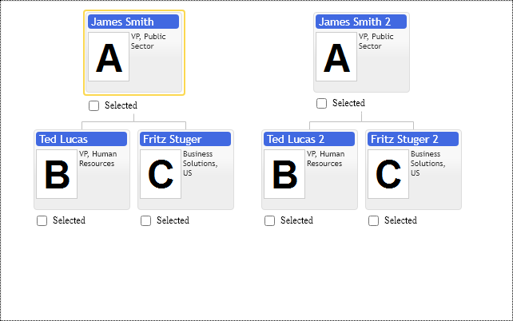
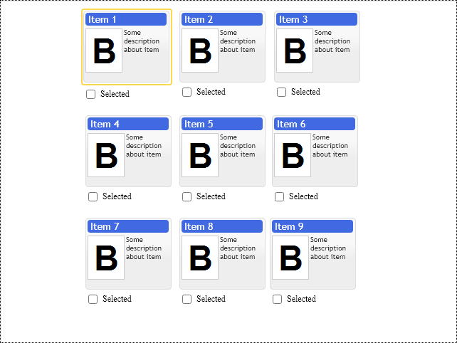

# Multiple root items in the chart

Multiple root items are convenient to display tree structure having missing parent relations for some nodes. The control would render such hierarchy using multiple tree fragments placed side by side in the diagram.

Following example shows two disconnected hierarchies: 

[JavaScript](javascript.controls/CaseMultipleRootItemsInChart.html)

## Matrix layout of multiple root items
It is an extreme example when nodes don't have parent relations at all. So the control displays them in the form of a long horizontal list of nodes. It isn't easy to scroll and manage them. The suggested solution is to shape root items into the matrixed formation, so our fragments take less space and fit into the available screen space.
The matrixed formation works best when we use drag and drop to merge nodes back to the tree structure, so we need to place our nodes close to each other.
In the following example, we create an invisible root item and use it as a parent node for all our parentless nodes in the structure. Then we set its `childrenPlacementType` option to `primitives.ChildrenPlacementType.Matrix`, so our nine nodes form compact 3 * 3 matrix formation.  

See Children Layout example to place fragments vertically or horizontally.

[JavaScript](javascript.controls/CaseMatrixLayoutOfMultipleRootItemsInChart.html)

