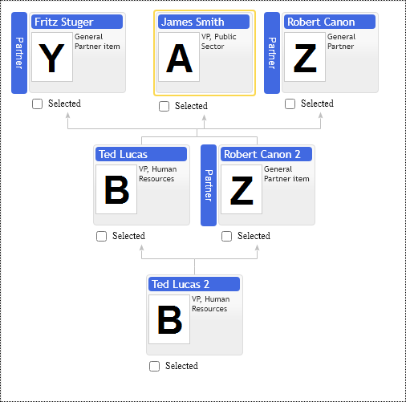

# Partner Item Types
In the organizational structures, we have many exceptions from traditional tree structure visualization. The partner item types allow elevating child nodes to the level of their parents. So visually, they non-distinguishable from their parents and displayed side by side with them.  For example, we can use partner item types when we need to show co-CEOs.  We add our second CEO item as a child item of the first CEO and set its item type to Partner. Partner item is placed at the same level as its logical parent and shares its parent's children, so visually, children equally belong to both of them. Optionally the parent node and its partner child have a horizontal line connecting them visually into one group.

Chart supports three types of partner types:

* GeneralPartner
* LimitedPartner
* AdviserPartner

They all share their parents' children, and the difference is in how they connect to their logical parent. The following example shows GeneralPartner, which shares children and parents of the logical parent, so visually, they are 100% equal on the org chart.

For the sake of simplicity, the Partner node can not have its logical children by design, so if you add children to the partner node, they would be auto-converted into partner's assistants. 

Use ItemConfig.adviserPlacementType option to place partners to the left or right side of their logical parent;

## General Partner

[JavaScript](javascript.controls/CaseGeneralPartnerItemType.html)

## Limited Partner

Limited Partner is a variation of GeneralPartner having no connection to the parent of the logical parent. Limited Partner shares children of the logical parent, but it does not share its parents. 

[JavaScript](javascript.controls/CaseLimitedPartnerItemType.html)

## Adviser Partner

Adviser Partner item type is a combination of Partner and Adviser types. It has an in-row horizontal connection to its logical parent, it shares children of the logical parent, but it has no links to its parents.

[JavaScript](javascript.controls/CaseAdviserPartnerItemType.html)

