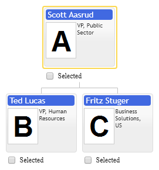
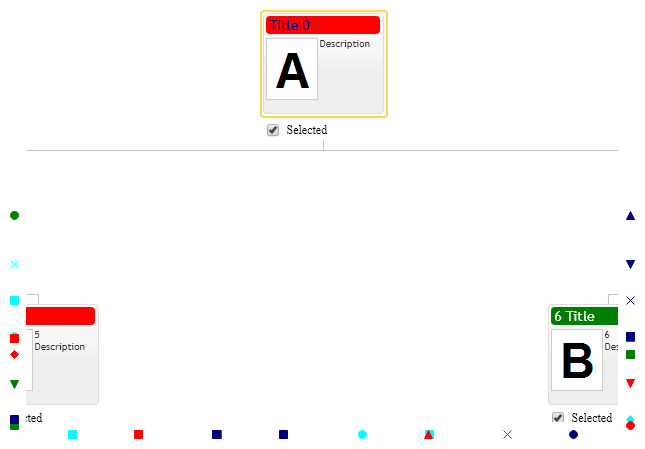

# Selected items & Check boxes
Selected items is collection of item id's having checked their check boxes. Chart always shows selected items in full size form.  So this can be convenient for navigation as well in order to keep interesting items in full size. 

Selected items can be used when we need to display cross functional working group in organization hierarchy or visualize large mail recipients list in organization by groups and seniority. Usually when number of people exceeds 10 it is hard to say who is enlisted in subscription except active participants.

Collection of `primitives.orgdiagram.Config.selectedItems` contains item id's. Widget notifies about changes in this collection with primitives.`orgdiagram.Config.onSelectionChanged` event.

Following example demonstrates how to programmatically select items in organizational chart  and get notified about changes in selection.

[JavaScript](javascript.controls/CaseSelectedItems.html)
[JQuery](jquery.widgets/CaseSelectedItems.html)

# Showing selected items on the frame

Control displays selected items placed outside control's view area on the frame around around control in form of markers. Control uses the same marker propeties defined by item templates for markers in the diagram. Markers placement on the frame indicates direction towards selected item outside control view area. Frame takes as much space as the largest marker in the diagram. Use `fameInnerPadding` and `frameOuterPadding` `Config` properties to add extra padding around frame markers.

[JavaScript](javascript.controls/CaseShowFrame.html)
[JQuery](jquery.widgets/CaseShowFrame.html)

