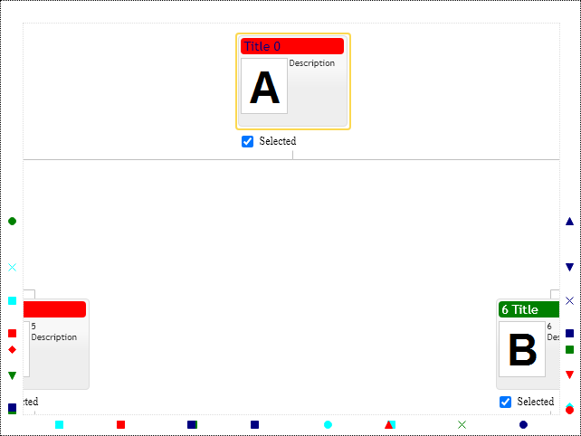

# Selected items & Checkboxes
Selected items property is the standard UI control option for multi-select of items in collection control. The selected items property is a collection of item ids:

```JavaScript
options.selectedItems = [1, 2, 3, 4];
```
The control displays selected items with checked checkboxes and in the full-size form. So this can be convenient for navigation. Users can browse diagram and checkmark nodes, so they stay pinned and visible. 

Use selected items property when you need to display cross-functional working groups in the organization hierarchy or visualize extensive mail recipients list in the organization by groups and seniority. Usually, when the number of people exceeds ten, it is hard to say who is in the subscription except for active participants.

Collection of `OrgConfig.selectedItems` contains item id's. The control notifies about changes in this collection with `OrgConfig.onSelectionChanged` event.

The following example demonstrates how to programmatically select items in the organizational chart and be notified about selection changes.

[JavaScript](javascript.controls/CaseSelectedItems.html)


# Showing selected items on the frame

The control displays selected items invisible in the current viewport on the control's frame as markers. The control uses the same marker properties defined by item templates for markers in the diagram. Marker's placement on the frame indicates the direction towards the selected item outside the control view area. The frame takes as much space as the largest marker in the diagram. Use `fameInnerPadding` and `frameOuterPadding` configuration properties to add extra padding around frame markers.

[JavaScript](javascript.controls/CaseShowFrame.html)

