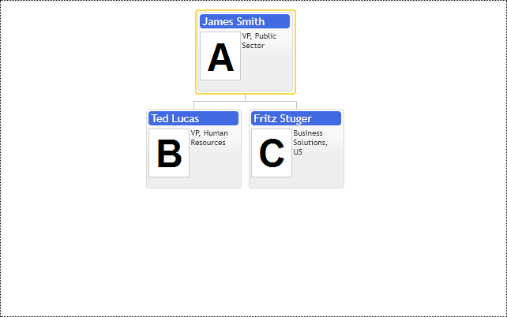

# Cursor Item & Mouse click
Organization Chart control has API options equivalent to a regular UI controls. The cursor item is used to select single item in hierarchy with mouse click, highlight item provides visual feed back on mouse over. Selected items collection is equivalent to checked items in ListView or TreeView controls.  

Chart's API is a hierarchy of objects. In order to select, highlight or navigate to one of them we have to reference them on API, for that purpose we use unique items ids.  In case of chart cursor navigation we assign cursor item id to primitives.OrgConfig.cursorItem property.  

Chart navigation depends on current cursor item, chart shows all parents of cursor item up to the root, its immediate children and siblings in full size mode, all other items can be folded into dots depending on available space. So cursor item plays a role of local zoom in the chart hierarchy. User navigates around chart via clicking and moving cursor item around and zooming into data around new cursor item.  

In order to avoid complete chart recreation on every click, the control has fast redraw mode, it is invoked by "update" method having its argument set to primitives.UpdateMode.Refresh. See "Adding new items to chart at runtime" use case for more details.  

The following example shows how to set cursor item programmatically and listen to notifications about users navigation in chart with primitives.OrgConfig.onCursorChange event. It is coupled with preceding primitives.OrgConfig.onCursorChanging event, which can be used in web applications to make server post backs without simultaneous unnecessary layout updates. See reference for cancel property of onCursorChanging event argument.  

If you want to avoid chart navigation and update before server post back use following code snippet:  


```JavaScript
options.cursorItem = null;
options.onCursorChanging = function (e, data) {
       data.cancel = true; /* cancel following onCursorChanged event */
};
```

If you need to disable mouse click for some item use isActive option of item and template configs. See "Inactive items" use case.  

If you need to disable completely mouse interactivity in the control you have to set `cursorItem` and `highlightItem` options into null and set `navigationMode` option to `NavigationMode.Inactive`  

## Keyboard navigation
The control is keyboard focusable. So when it gets focus with TAB or mouse click there is blue `outline` around it indicating keyboard focus. The control supports keyboard arrows to select highlighted item and `Enter` to set cursor. So when control gets focus user has to use arrows to highlight item and then press enter to set cursor to it.  

Take into account that item template may contain HTML elements supporting keyboard focus and keyboard commands.  

[JavaScript](javascript.controls/CaseSelectingCursorItem.html)

