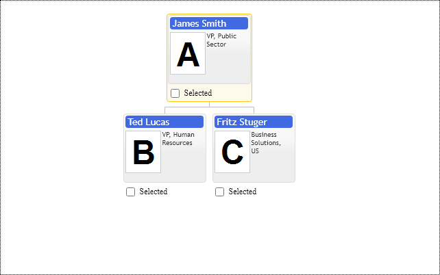

# Highlight item & Mouse over feedback
Highlight provides visual feed back for mouse over and indicates current item of keyboard focus in chart.

It can be used to synchronize other UI elements with chart and show some extra immediate information about item without changing cursor position. Widget notifies about highlight item change with primitives.OrgConfig.onHighlightChange event.

Current highlight item in chart is defined with option primitives.OrgConfig.highlightItem and indicates current item close or under mouse cursor. Actually chart always highlights at least one item in chart the most close to mouse cursor. If user clicks outside of any item then current highlight becomes active cursorItem. The highlightItem option is item id. In order to promptly change highlight position in chart use following argument of update method:

```JavaScript
control.update(primitives.UpdateMode.PositonHighlight); 
```
If you need to disable highlight you have to set highlightItem option to null and navigationMode to primitives.NavigationMode.CursorOnly

Keyboard navigation

The widget is keyboard focusable. So when it gets focus with TAB or mouse click there is blue "outline" around it indicating keyboard focus. The widget supports keyboard arrows to select highlighted item and "enter" to set cursor. So when control gets focus user has to use arrows to highlight item and then press enter to set cursor to it.  

Take into account that item template may contain HTML elements supporting keyboard focus and keyboard commands.  

[JavaScript](javascript.controls/CaseSelectingHighlightItem.html)

