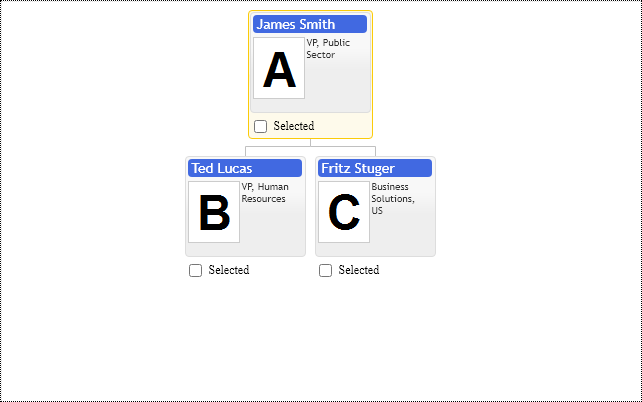

# Highlight item & Mouse over feedback
Highlight provides visual feedback for mouseover and indicates the current node of keyboard focus in the chart. It is a lightweight operation that does not change the diagram layout.  Your application can use highlight API to display some node context information in the side panel. The control notifies about highlight item change with primitives.OrgConfig.onHighlightChange event.

Use `primitives.OrgConfig.highlightItem` property to set or get the currently highlighted node in the diagram.
When the end-user moves the mouse cursor, the control may highlight nodes within some space around the cursor defined with the option `highlightGravityRadius`. It is handy when we need to click on a small marker. Still, at the same time, it may decrease the control's performance if the radius is too big because the component finds the nearest node within the area of that radius, and that radius may cover hundreds or thousands of nodes.
If the user clicks outside of the highlighted item, then control moves the cursor item to it. See `cursorItem` property of the `OrgConfig` configuration object. 
Every node must have a unique id. See `id` property of `OrgItemConfig` configuration object. Use those ids when you set the highlightItem option value.
The following update method parameter is legacy, but it still works. It ensures that control does not do any layout updates except the actual highlight node change:

```JavaScript
control.update(primitives.UpdateMode.PositonHighlight); 
```
If you need to hide highlight, you have to set the highlightItem option to null. If you need to disable highlight functionality in control, it is useless on mobile devices; you have to change the `navigationMode` option to `primitives.NavigationMode.CursorOnly`.

## Keyboard navigation

The control is keyboard focusable. So when it gets focus with TAB or mouse click, there is a blue "outline" around it indicating active keyboard focus. Use primitives.css file to disable or style that "blue" outline.
 
The control supports keyboard arrows keys to choose highlighted node and `Enter` key to set cursor for it. So when the component gets focused, you have to see the blue outline, then you have to use Arrows keys to highlight the item you want to move the cursor to, and then press Enter key to set the cursor to it.  Don't forget that if you need to expand marker nodes, you need to move the cursor node close.  

Suppose your node templates contain HTML elements supporting keyboard focus and keyboard interactivity.  All of them are going to have their TAB order. Use buttons panel to place HTML elements having a keyboard or mouse interactivity elements above all other diagram elements, so they are not blocked. See the context buttons sample for more details.

[JavaScript](javascript.controls/CaseSelectingHighlightItem.html)

