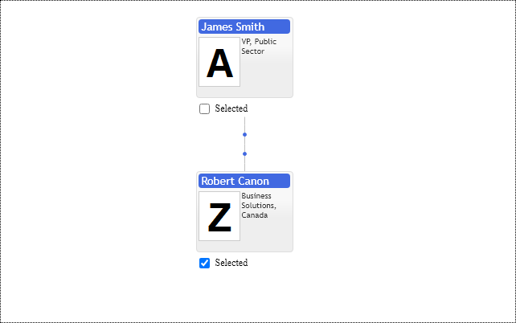

# Selection Path Mode
If total square size of items exceeds available screen size, there is no possibility to show all of them and chart should use various strategies to show the most important information. By default organizational chart always shows `primitives.OrgConfig.cursorItem` and all its children and parents up to the rootItem in hierarchy in maximized template form. The same rule applies to selected items. For all other less important items chart is allowed by default to fold them into dots or lines.

Selection path is items between root item and selected item. Selected item defined with `primitives.OrgConfig.selectedItems` collection. User can force to show selection path with option `primitives.OrgConfig.selectionPathMode` set to `primitives.SelectionPathMode.FullStack` or permit layout manager to collapse it to dots or lines with `primitives.SelectionPathMode.None`.

When we need to compare two or three selected items location in Organizational chart it is important to show selection path items for them. In case of large number of selected items it is better to hide selection paths in order to save as much space as possible and fit chart into screen.

Pay attention that org chart always shows selection path for cursor item. So in case when selected item is cursor item  the setting `primitives.OrgConfig.selectionPathMode` to `primitives.SelectionPathMode.None` is ignored.

[JavaScript](javascript.controls/CaseSelectionPathMode.html)

