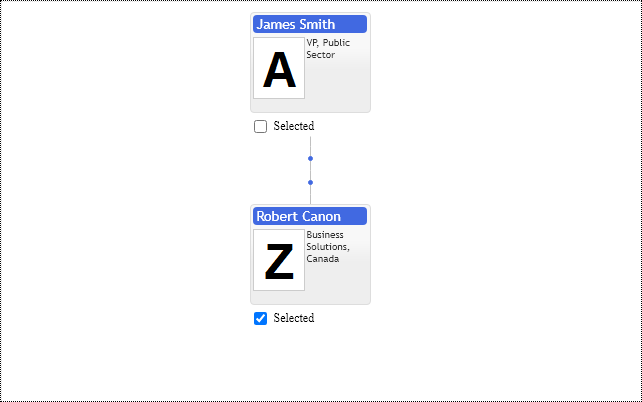

# Selection Path Mode
Suppose the total square size of items exceeds the available screen size. There is no possibility to show all of them, and the chart should use various strategies to display the essential information. By default organizational chart shows the current cursor item and all its children and parents up to the root of the hierarchy. The same rule applies to the list of selected items. All other less essential nodes, chart is allowed to display in the form of markers and lines.

The selection path is a collection of parents between any node and the root of the hierarchy. The control can show the selection path for the current cursor node and selected nodes as well. If you need to show selection path nodes, set the option `primitives.OrgConfig.selectionPathMode` to `primitives.SelectionPathMode.FullStack` or hide them to markers with `primitives.SelectionPathMode.None` option.

When we need to compare two or three selected items in the organizational chart, it is essential to show their selection paths. It gives you context for nodes comparison:  immediate managers,  departments, and relative levels in the organization. In the case of many selected items, it is better to hide selection paths to save valuable space and fit the chart into the screen.

[JavaScript](javascript.controls/CaseSelectionPathMode.html)

