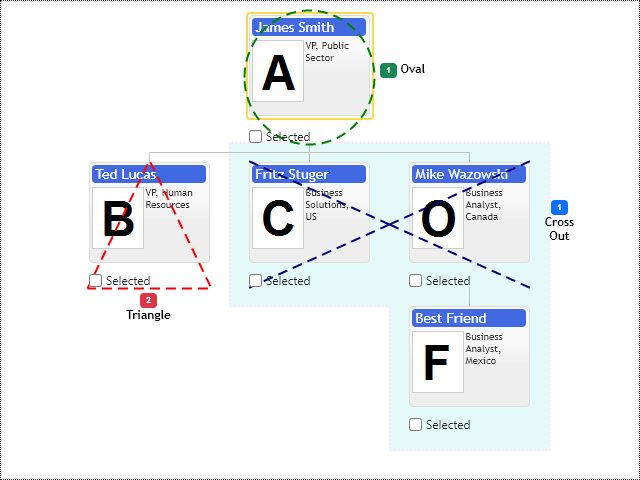

# Shape & Background Annotations
## Shape
Diagrams support on-screen annotations for visualization of non - hierarchical relations between items. Shape annotation uses optionally SVG or Canvas to draw geometrical figures, diagram draws them at one layer, so their number does not affect diagram rendering performance. If you need some specific custom shapes you have to make changes to the source code or just use images and custom items templates:
* Rounded Rectangle
* Oval
* Triangle
* Cross Out
* Circle
* Rhombus

If you define multiple items then it is drawn as a one large shape on top of them. This is actually the main idea behind this annotation, to use single shape for group of nodes. In case if you need multiple individual annotation then you have to create shape annotation for every item. If you don't define background or border line color then they are not drawn. Annotation supports its own label which can be placed on the side of annotation.

## Background Annotation
This visual is regular background area having border line and fill color. When we draw the same annotation for multiple items, control automatically blends them into single shape object. It helps to minimize clutter in diagram. Use `includeChildren` option to expand background around item and all of its descendants. 

[JavaScript](javascript.controls/CaseShapeAnnotation.html)
[PDFKit](pdfkit.plugins/ShapeAnnotation.html)

