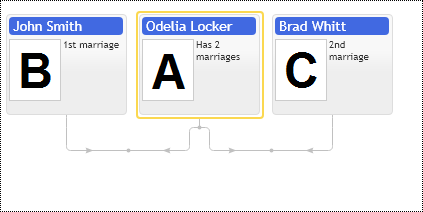

# Spouses having no children in the family structure

The following example demonstrates the visualization of spouses having no common children. They are supposed to be displayed side by side or at least should have a visual connection. Family diagram component provides `spouses` collection property in `FamItemConfig` options class.

We usually need to show the marriage date anyway, so to do that, the best solution is to create another diagram node for the marriage and connect spouses and their children via it. See family diagram nodes ordering demo.

[JavaScript](javascript.controls/CaseSpousesInFamilyLayout.html)

