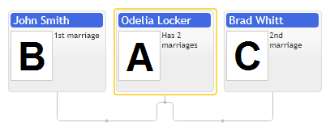

# Spouses having no children in family chart

Following example demonstrates visualization of spouses having no common children. They are supposed to be displayed side by side or at least should have visual connection. famDiagram provides `spouses` collection property in `primitives.famdiagram.ItemConfig` options class.

[JavaScript](javascript.controls/CaseSpousesInFamilyLayout.html)
[JQuery](jquery.widgets/CaseSpousesInFamilyLayout.html)

